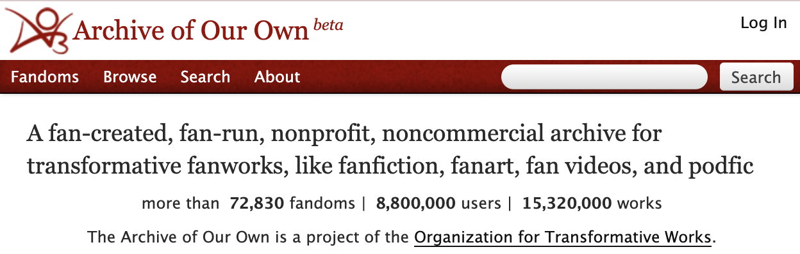

| Links                                           |                                               |
| ----------------------------------------------- | --------------------------------------------- |
| [Github →](https://github.com/thalida/ao3-sync) | [Docs →](https://thalida.github.io/ao3-sync/) |

AO3 Sync is a tool to downlaod your bookmarks from [Archive of Our Own](https://archiveofourown.org) (AO3)
and save them to your local machine. This tool is designed to be run on a regular basis to
keep your local bookmarks up-to-date with your AO3 account.


## Quick Start


### Installation

```bash
poetry add ao3-sync
```


### Sync Bookmarks

```bash
ao3-sync bookmarks
```


## Features

- Set the start and end page for bookmarks
- Sort bookmarks by date bookmarked or date updated
- Specifcy the file format to download (eg. HTML, EPUB, MOBI, PDF, AZW3)


## Roadmap

- [ ] Add support for syncing subscriptions
- [ ] Support filtering and searching bookmarks
