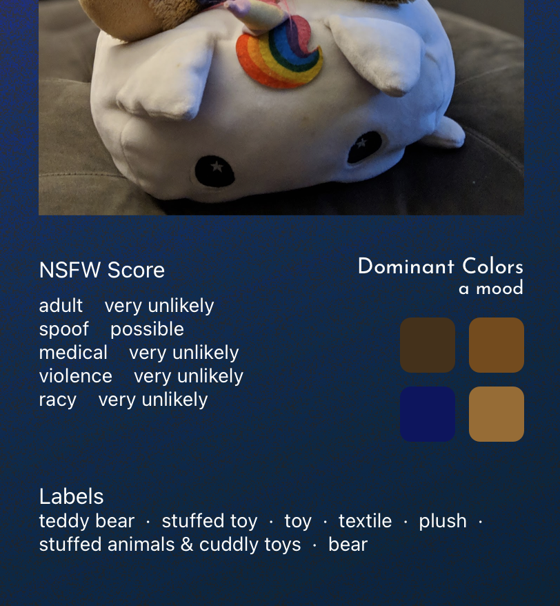
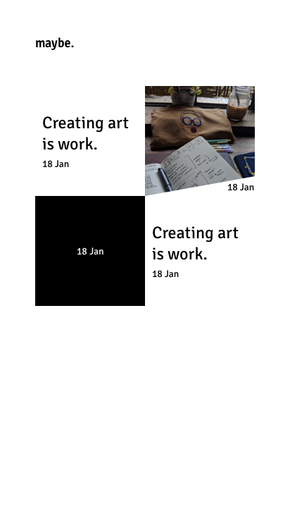
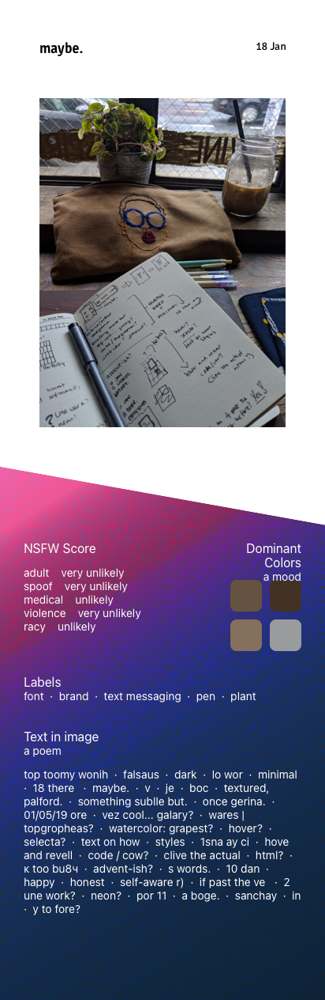
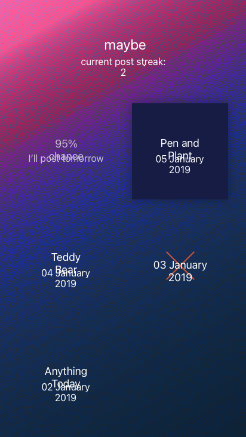
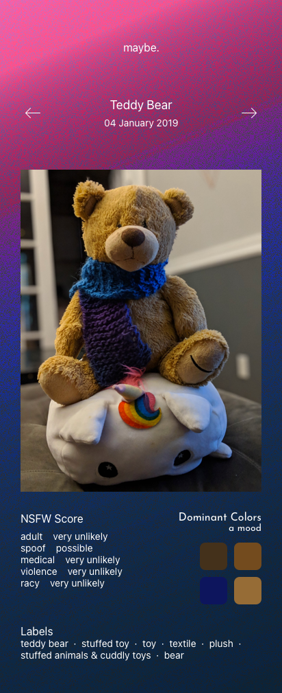

| Links                                               |     |
| --------------------------------------------------- | --- |
| [Github →](https://github.com/thalida/maybe.social) |     |

## 🧠🌩 Brainstorm

- Use sentiment analysis to describe my social media posts
- Automatically pull dominant colors from photos (and analyze over time?)

## 🎨 Design

### Mockups

#### **V1**

|     |     |
| --- | --- |
|  |  |

#### **V2**

|     |     |
| --- | --- |
|  |  |
