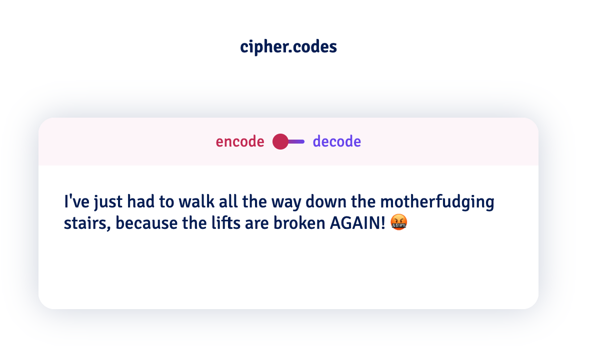

| Links                                                |                                     |
| ---------------------------------------------------- | ----------------------------------- |
| [Github →](https://github.com/thalida/ciphers.codes) | [Website →](https://ciphers.codes/) |

## Supported Ciphers

### Affine

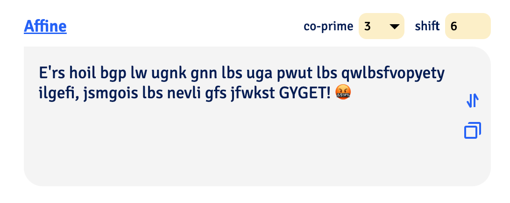

A monoalphabetic substitution cipher. Each letter in the alphabet is mapped to a number, then encrypted/decrypted
using a math formula, and finally converted back to a letter.
[Learn more](https://ciphers.codes/about/affine)

### Atbash

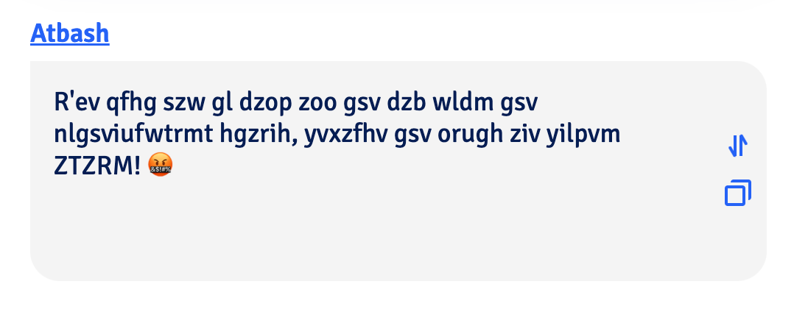

A simple substitution cipher originally created for the Hebrew alphabet. When used with the English alphabet,
this cipher reverses the alphabet.
[Learn more](https://ciphers.codes/about/atbash)

### Caesar

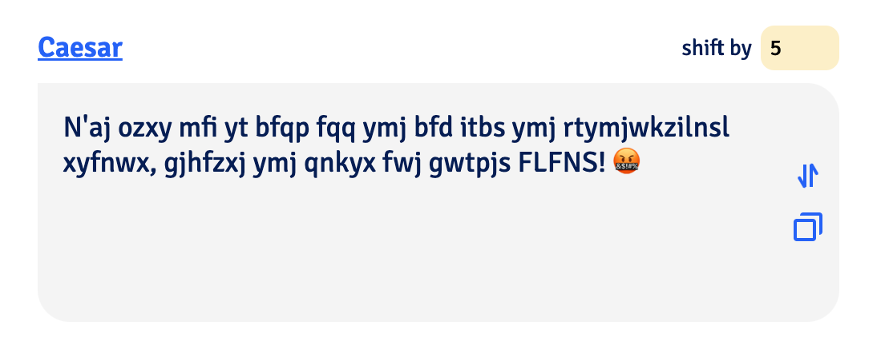

A popular substitution cipher, where the alphabet is shifted up or down a specified number of positions.
[Learn more](https://ciphers.codes/about/caesar)

### Keyed Substitution

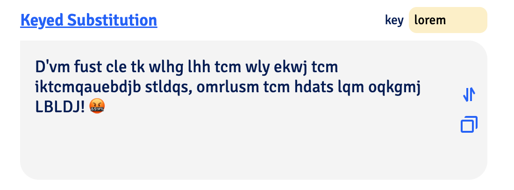

A monoalphabetic substitution cipher, where a keyword placed into beginning of the alphabet,
and any duplicated letters are removed.
[Learn more](https://ciphers.codes/about/keyed-substitution)

### Masonic

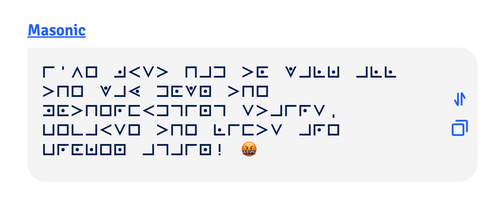

A geometric simple substitution cipher which exchanges letters for symbols which are fragments of a grid.
[Learn more](https://ciphers.codes/about/masonic)

### Playfair

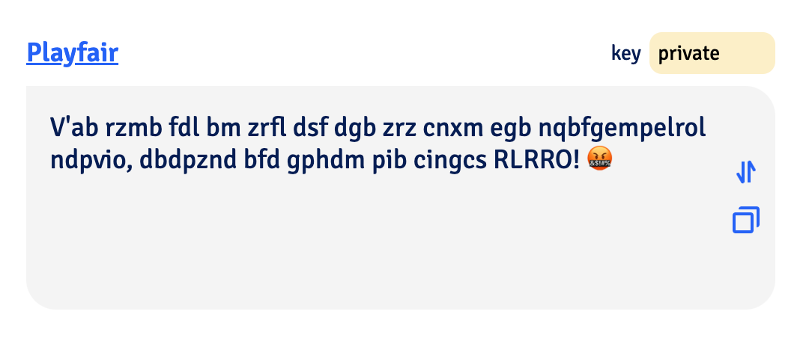

Encrypts pairs of letters, using a 5x5 grid. [Learn more](https://ciphers.codes/about/playfair)

### Polybius Square

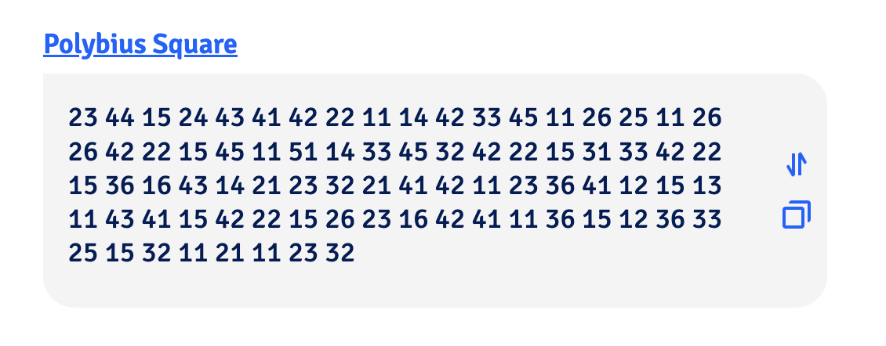

A cipher where each alphanumeric (a-z, 0-9) character is represented by it’s coordinates in a grid.
[Learn more](https://ciphers.codes/about/polybius-square)

### Vigenère

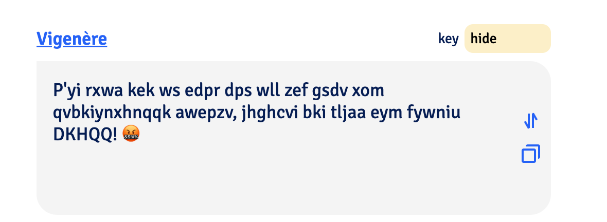

A simple polyalphabetic substitution cipher which uses a tableau composed of each of the 26 options
of the [Caesar Cipher](https://ciphers.codes/about/caesar).
[Learn more](https://ciphers.codes/about/vigenere)

## 🎨 Design

Catalog of various redesigns over time as I got the itch to work on this again.

| | |
| --- | --- |
| 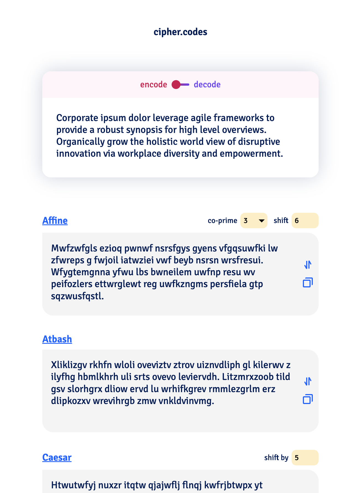 | 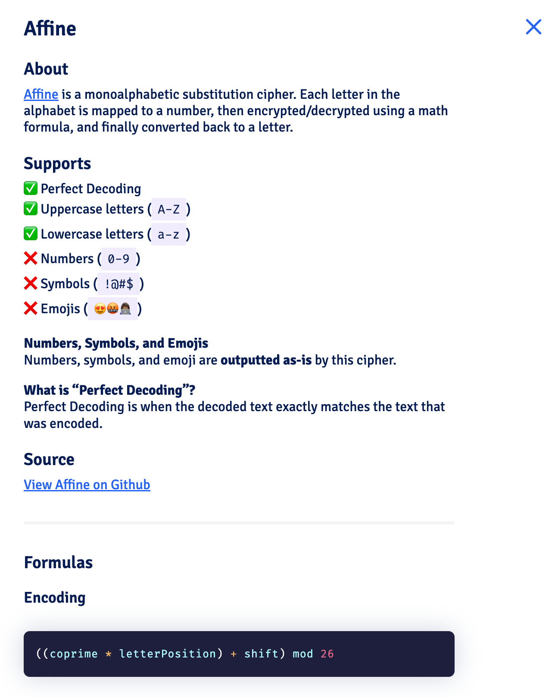 |
| 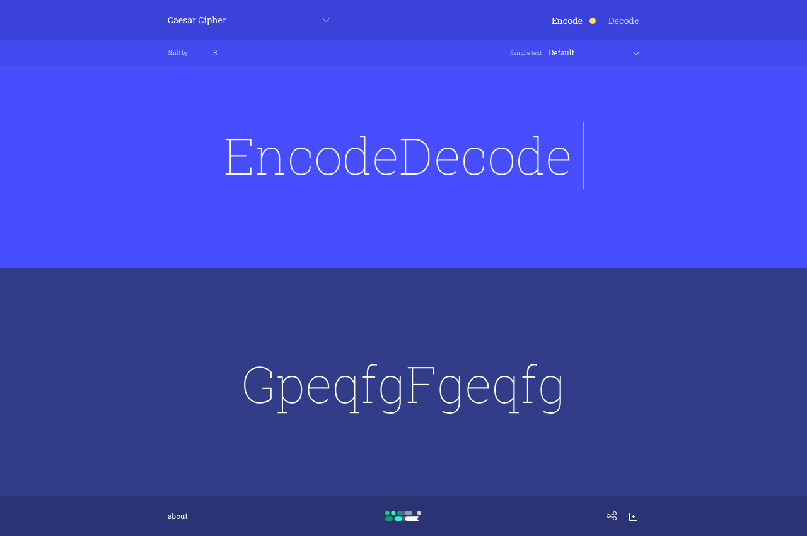 | 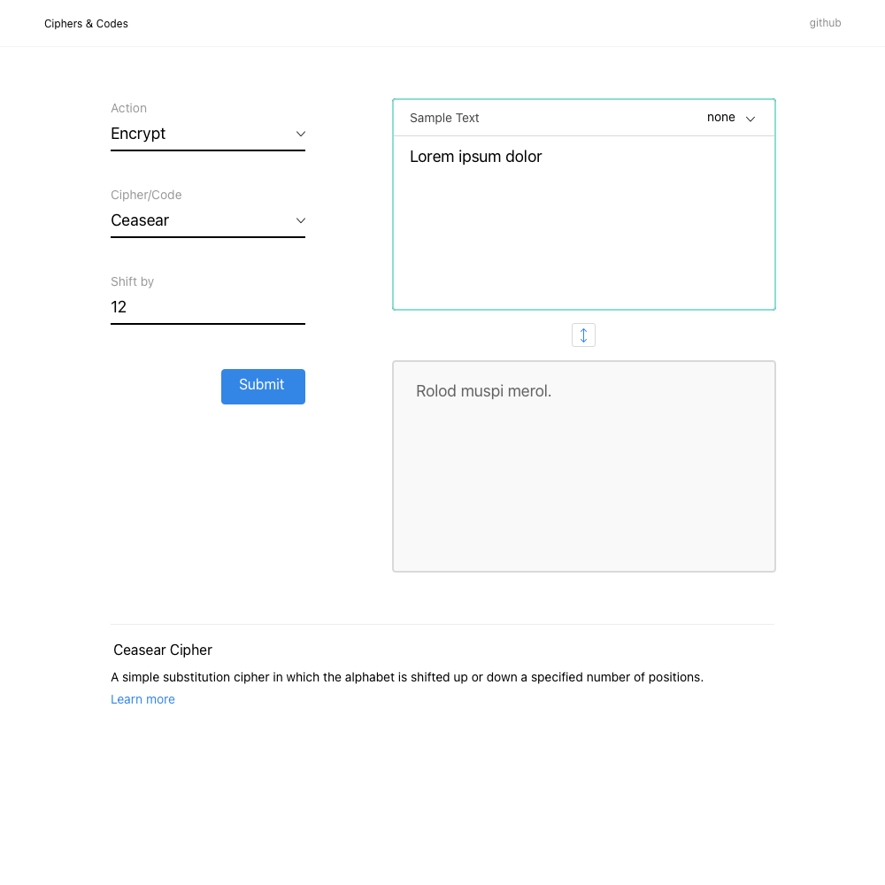 |
| 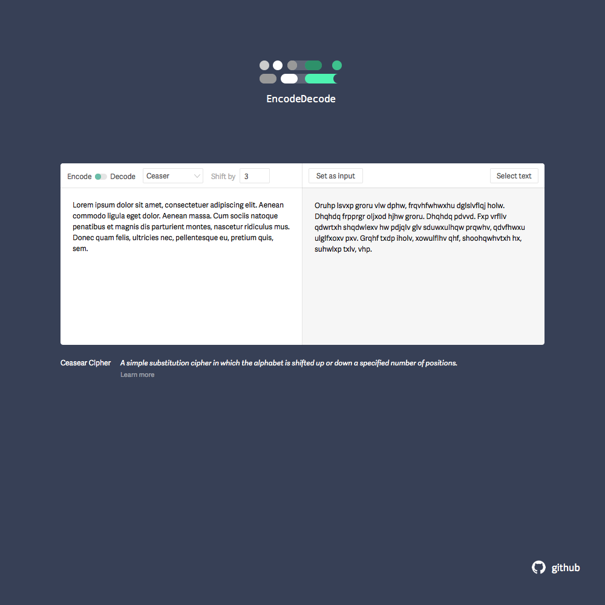 |  |
