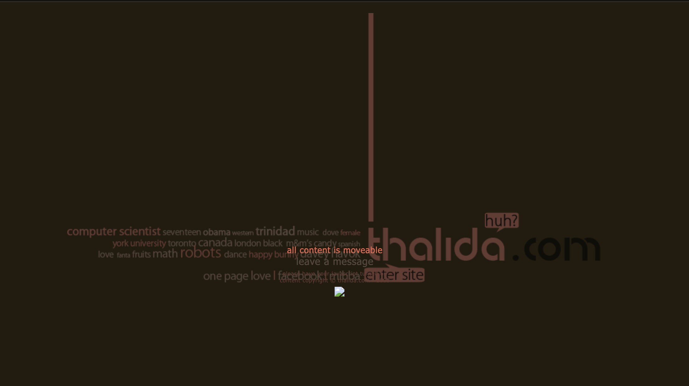

| **Year(s)**                 |     |     |
| --------------------------- | --- | --- |
| January 2007 - January 2012 |     |     |

## Overview

Somewhere around 2012/2013 I couldn’t afford hosting.

I wasn’t using svn or git, and was deploying by coping files over via ftp.

When I wasn’t able to pay, I lost my entire account including all previous versions of thalida.com.

The following history is all gathered from various designs I had saved on a flashdrive.

## Screenshots

I've pulled together some screenshots from the lost era of thalida.com, showcasing the designs and features that were
part of this period.

