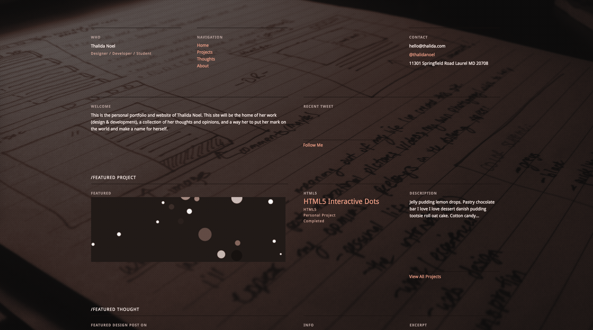

| Year | GitHub | Link |
| ---- | ------ | ---- |
| Jan 2012 - Jan 2013 | [Github](https://github.com/thalida/thalida.com/tree/v-2012) | [Live](https://2012.v.thalida.com) |

## Story

Site Design #8 is the oldest existing version of my site. The first seven versions have been lost to history (and [onepagelove](https://onepagelove.com/thalida)).

## **Designs**

My first design had a very simple dark background

_I was going through a “brown” phase._

I was messing around with the idea of having a background image or pattern, and I thought it'd be cool to use a photo
of a page in my notebook as the background of the site.

Tested it out on Photoshop, liked the look, and it became part of my final design.

> [!NOTE]
> 👄 _The page in the background is actually a rough sketch of this site design_
