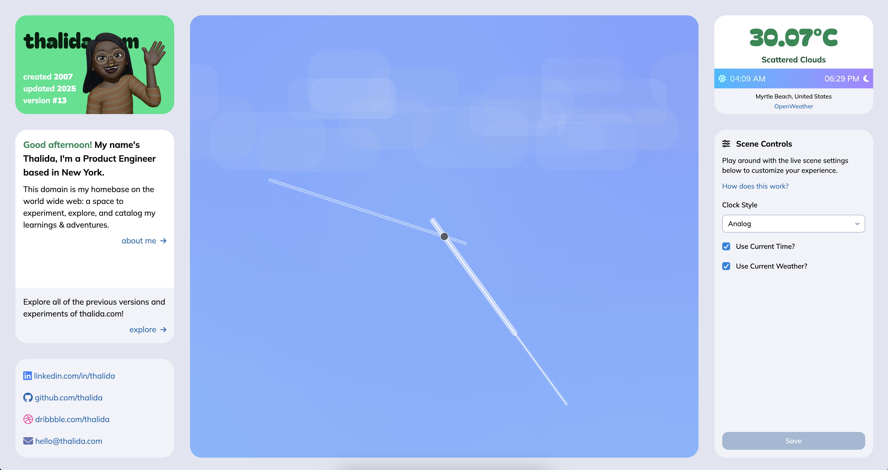
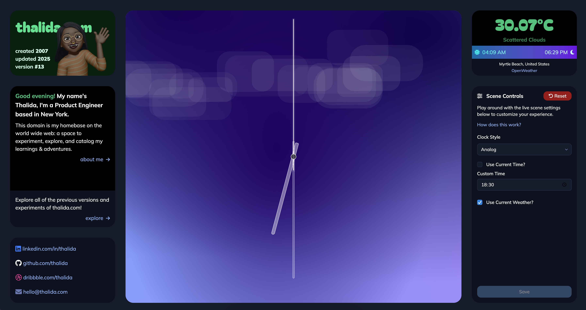
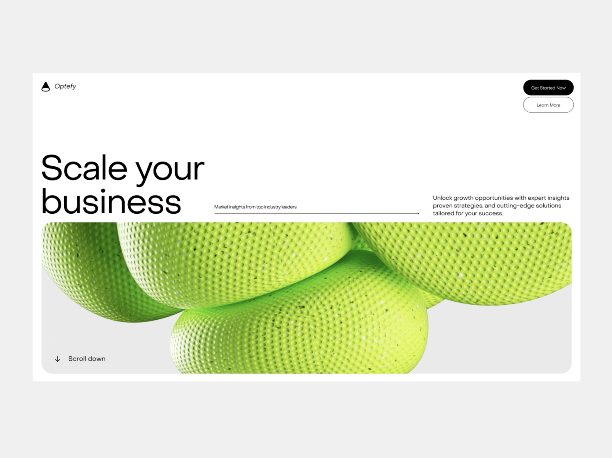
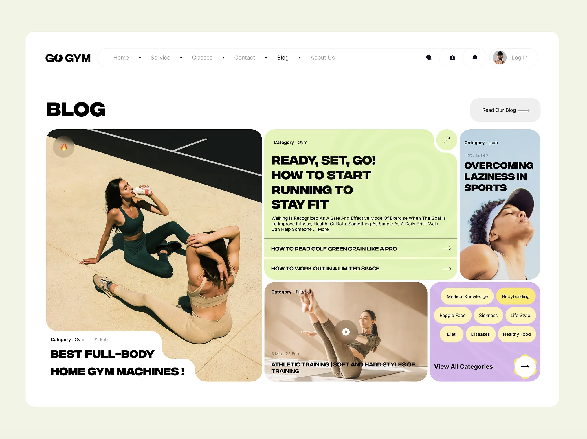
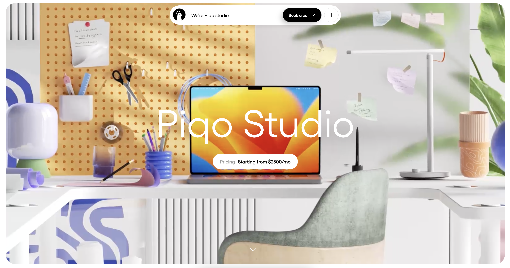
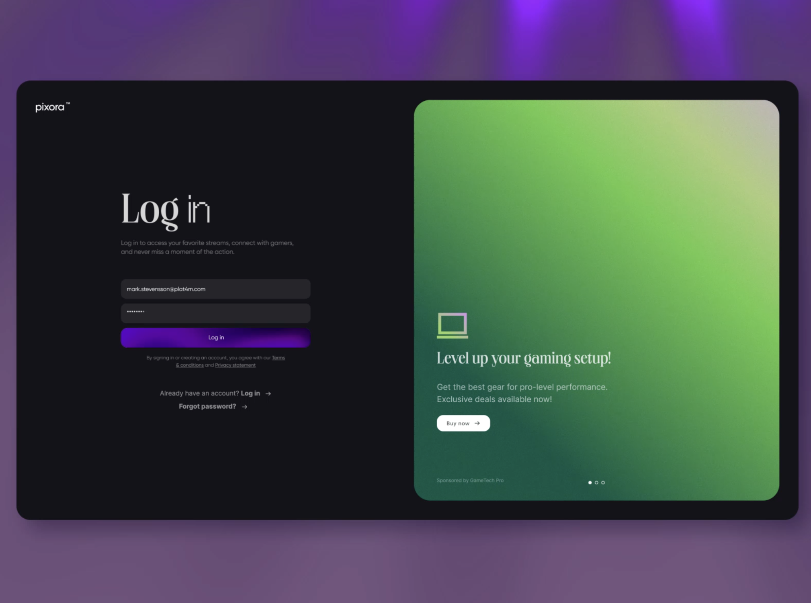
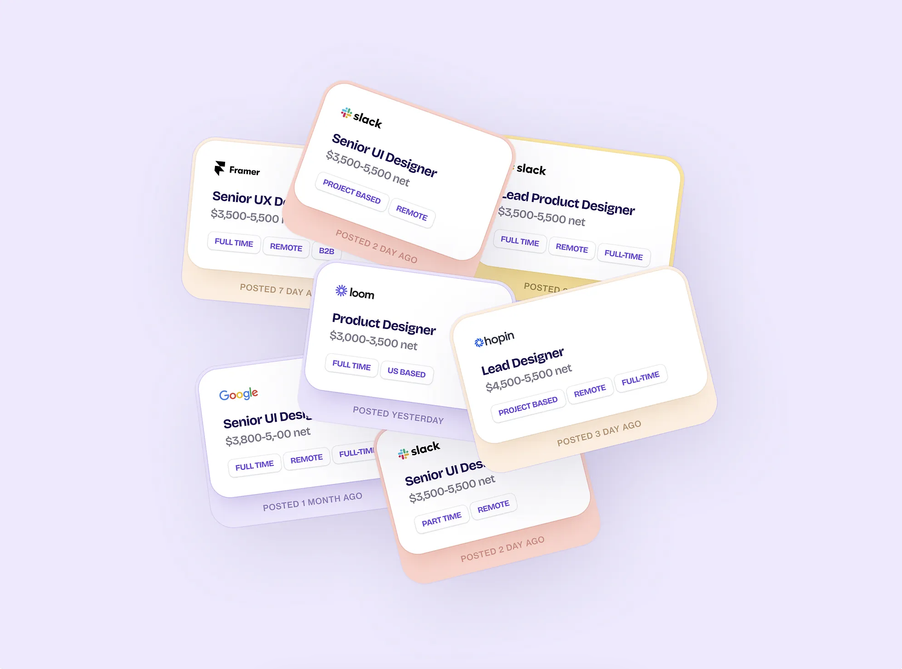
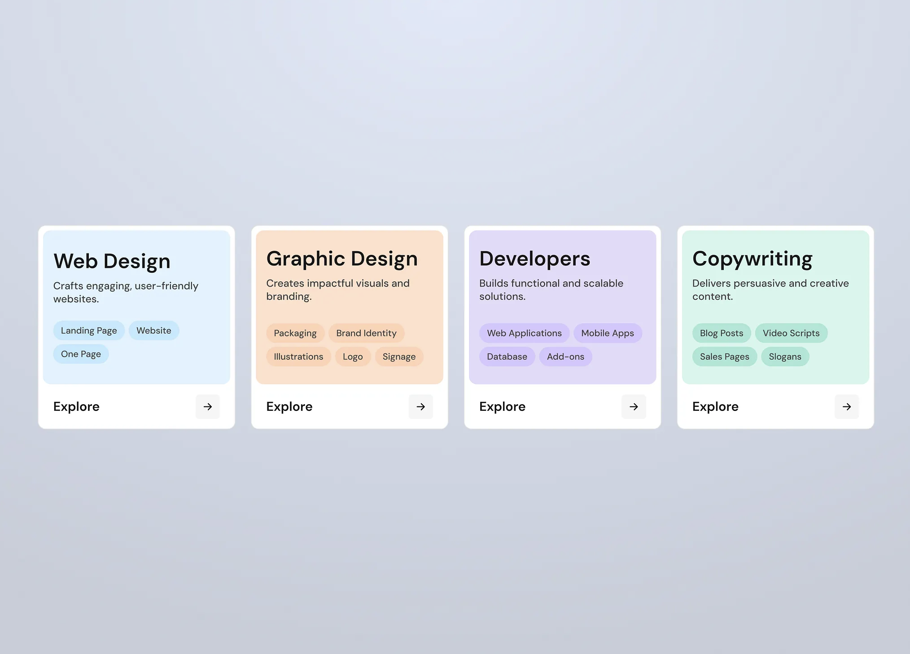

| Year | GitHub | Link |
| ---- | ------ | ---- |
| Jul 2025 - Feb 2026 | [Github](https://github.com/thalida/thalida.com/tree/v-2025) | [Live](https://2025.v.thalida.com) |


## Goals

After having used Super / Notion for a while, I wanted to move to a more flexible and
customizable solution. Super was great for quick setups, but I missed the ability to fully
control the design and functionality of my site.


## Blog Implementation

The site is built using [Astro](https://astro.build/), a modern static site generator
that allows for a high degree of customization and performance optimization.

The site is deployed on [Vercel](https://vercel.com/), which provides excellent performance
and scalability.


## Live Weather & Time


### Implementation




The live weather and time functionality is implemented using the
[Open Weather API](https://openweathermap.org/api). I get the users current location using
their IP via [https://ipregistry.co/](https://ipregistry.co/).

The window itself is made by using a custom Web Component which enables me to place the
window anywhere on any page easily. The web component loads and renders a scene created
with [Matter JS](https://brm.io/matter-js/).


### Customization


The window effect is customizable, users can switch between analog and digital clocks,
change the time, and choose between different weather effects


## Design Inspiration


### Colors, Vibe, Layout









- <https://piqo.studio/>
- <https://dribbble.com/shots/21289412-Blog-Page-for-Fitness-Website>
- <https://dribbble.com/shots/25771286-Modern-Website>
- <https://dribbble.com/shots/26107156-Smart-Streaming-Interface>
- <https://dribbble.com/shots/26121703-Credly-Fintech-Landing-Page-Hero>
- <https://dribbble.com/shots/25721588-Case-Study-Blanket-Brand-Visual-Identity-and-Packaging>
- <https://dribbble.com/shots/25445552-Loyalty-Cards-Wallet-App-Animation>


### Cards





- <https://dribbble.com/shots/26039541-City-flight-ticket-booking-cards>
- <https://dribbble.com/shots/24317197--talently-brand-identity-cards>
- <https://dribbble.com/shots/26043592-Talent-Hire-Platform-Website-UI-Design-Cards>


## Meta

<details>
  <summary>Styleguide & Components</summary>


### Admonitions


#### Note

> [!NOTE]
> Optional information that can help users understand the context or provide additional insights.

```md
> [!NOTE]
> Optional information that can help users understand the context or provide additional insights.
```


#### Tip

> [!TIP]
> Optional information to help a user be more successful.

```md
> [!TIP]
> Optional information to help a user be more successful.
```


#### Important

> [!IMPORTANT]
> Crucial information necessary for users to succeed.

```md
> [!IMPORTANT]
> Crucial information necessary for users to succeed.
```


#### Warning

> [!WARNING]
> Critical content demanding immediate user attention due to potential risks.

```md
> [!WARNING]
> Critical content demanding immediate user attention due to potential risks.
```


#### Caution

> [!CAUTION]
> Negative potential consequences of an action.

```md
> [!CAUTION]
> Negative potential consequences of an action.
```

</details>
