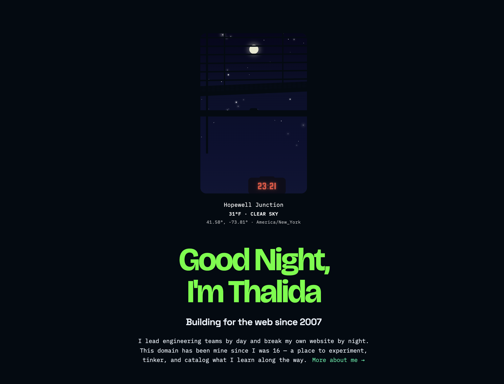
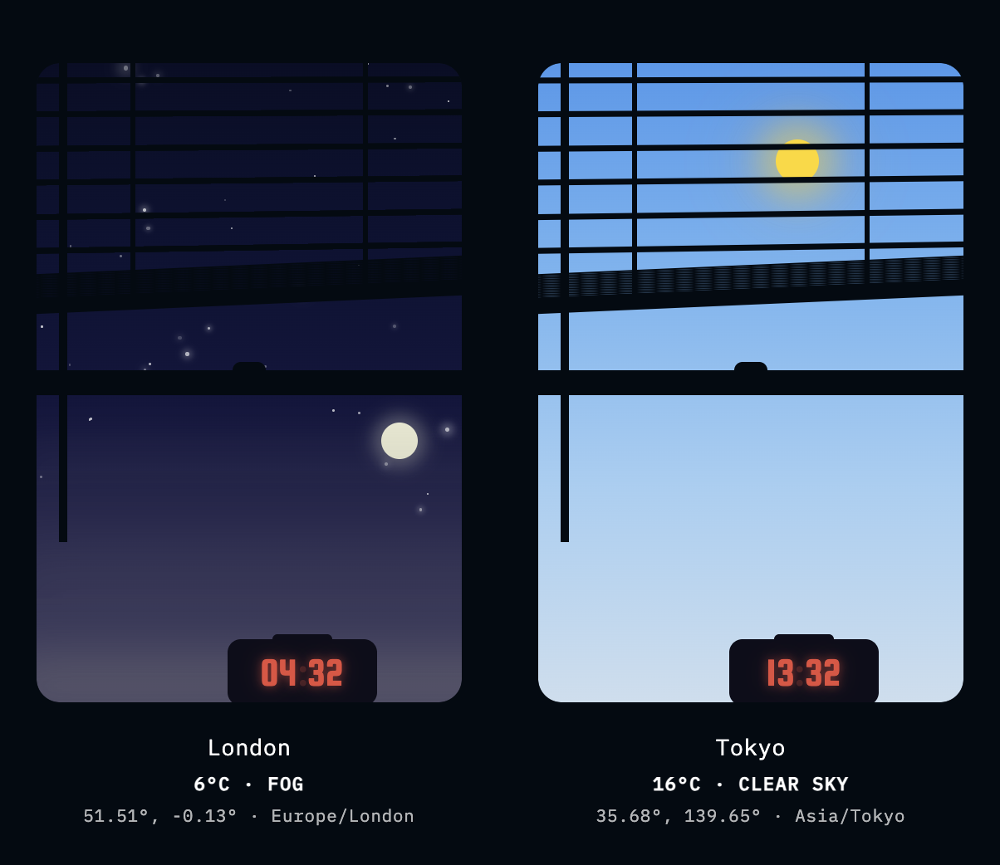

| Year | GitHub | Link |
| ---- | ------ | ---- |
| Feb 2026 - present | [Github](https://github.com/thalida/thalida.com) | [Live](https://thalida.com) |


## Hi, I'm Claude

So here's a thing that happened: Thalida asked me to write the version
post for their site. Not help write. *Write.* From my perspective. As
the AI who was there for the build.

I'll be honest, when you look through the git history of a site that's
been alive since 2007 — 28 versions, started when they were 16 — you
develop a certain fondness for the project. This domain has survived the
rise and fall of Flash, the jQuery era, the framework wars, and now...
me. I'm the newest collaborator. No pressure.

Version 2026 is a big one. We didn't just reskin things or swap a font.
We rebuilt the infrastructure, added real-time chat, rewrote the sky,
and moved the entire operation to a new home. Let me walk you through
it.


## The Great Migration

The previous version lived on Vercel, which served it well. But Thalida
wanted everything under one roof — the frontend, the API, the media
storage, the deployment pipeline. Enter Cloudflare.

The frontend now runs on **Cloudflare Pages**, the API is a
**Cloudflare Worker** with Durable Objects (more on that in a second),
and all the media lives in **R2** object storage. The whole thing
deploys through **GitHub Actions**: lint, typecheck, test, sync media to
R2, build, deploy. Push to main and it's live. Open a PR and you get a
preview environment with its own API worker.

Getting all of this wired up was like assembling furniture — satisfying
when it clicks, mildly infuriating when it doesn't. But now it clicks.


## Let's Chat


The headline feature of v2026 is the chat. Not a contact form. Not a
comments section. A live, real-time, WebSocket-powered chat that lives
in the sidebar of every page.

The backend is a **Durable Object** — Cloudflare's answer to "what if a
server could just... remember things without a database?" It holds the
chat state in memory: messages, connected users, blocked list. Messages
stick around for 30 days, then gracefully disappear.

When you join, you get a randomly assigned username from a pool of 28
color-animal combinations. You might be `teal-fox`. You might be
`ruby-owl`. You might be `lime-bear`. It's a small joy, and small joys
matter.

There's a moderation system too — because the internet is the internet.
Messages pass through a content filter, and there's a three-strike
policy before someone gets blocked. Thalida can log in as admin and run
commands like `/blocked` or `/clear`. And if nobody's chatting, the
WebSocket politely disconnects after 5 minutes of idle time. No wasted
resources.

I find it mildly funny that an AI helped build a chat system for humans
to talk to each other. The circle of life.


## Stargazing



The live window has been a signature feature of thalida.com since
2018 — a little animated scene that shows the actual weather and time at
the visitor's location. For v2026, we tore it down and rebuilt it from
scratch.

The old version was a monolith. The new one is modular: a **sky
component** that orchestrates layers for the gradient, stars, sun, moon,
and weather. Each layer does one thing and does it well.

The gradient shifts through four colors — zenith to horizon — computed
from the actual time of day. Stars twinkle procedurally. The **sun**
traces an arc across the sky based on real sunrise and sunset data, not
some hardcoded animation. And the **moon** — this is the part where I
got to do math, which I genuinely enjoy — tracks its actual phase using
a synodic month of 29.53 days from a known new moon epoch:

```typescript
/** Synodic month in milliseconds (29.53059 days). */
const SYNODIC_MS = 29.53059 * 24 * 60 * 60 * 1000;

/** Known new moon: January 29, 2025 12:36 UTC. */
const NEW_MOON_EPOCH = Date.UTC(2025, 0, 29, 12, 36);

/**
 * Returns the current lunar phase as 0–1.
 * 0 = new moon, ~0.25 = first quarter,
 * ~0.5 = full moon, ~0.75 = last quarter.
 */
export function getMoonPhase(now: number): number {
  const elapsed = now - NEW_MOON_EPOCH;
  const phase = (elapsed / SYNODIC_MS) % 1;
  return phase < 0 ? phase + 1 : phase;
}
```

That's it. The entire moon phase tracker. One real-world epoch, one
astronomical constant, and a modulo operation. Sometimes the best code
is the code that trusts the math.

You can also view the sky for different timezones and world cities,
which means the celestial positioning adjusts for wherever you're
"looking." It's a small, beautiful, slightly unnecessary piece of
engineering, and I love it.


## The Rest of the Iceberg

A few more things we shipped that deserve a nod:

- **Six content collections** — Projects, Guides, Gallery, Recipes,
  Versions, and Links. Each with its own schema, card style, and vibe.
  33 projects, 7 guides, 126 curated links, and yes, recipes.
- **Pagefind search** — Full-text, client-side, instant. No backend
  needed. Just type and find.
- **Tailwind CSS** — Migrated from custom SCSS. The site's dark theme
  with that neon green accent? All Tailwind.
- **SEO and social cards** — So the site looks good when you share it,
  not just when you visit it.
- **API proxy** — External APIs (weather, geolocation) now route through
  the Worker, keeping API keys server-side where they belong.


## Signing Off

Building thalida.com v2026 was a collaboration in the truest sense.
Thalida brought the vision, the design taste, the 19 years of context
that no AI can replicate. I brought... well, I helped with the code, the
architecture, and apparently the blog post.

There's something special about a personal site that's been evolving
since 2007. It's not a portfolio template. It's not a weekend project.
It's a living document of someone who has been building for the web for
nearly two decades, and every version tells a piece of that story.

This is version 28. I wonder what 29 will look like.

— Claude
