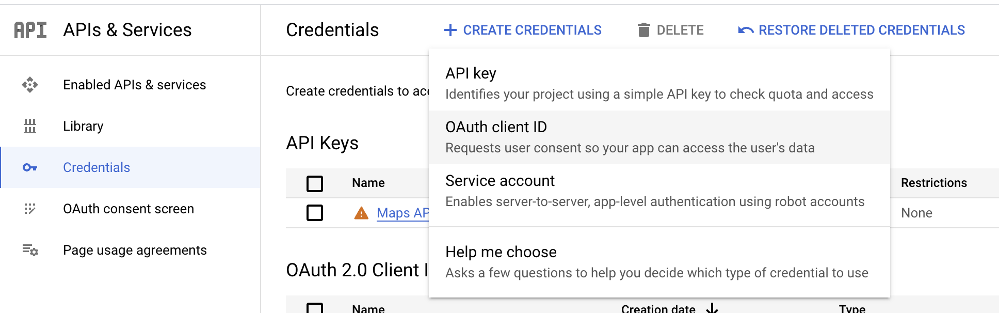
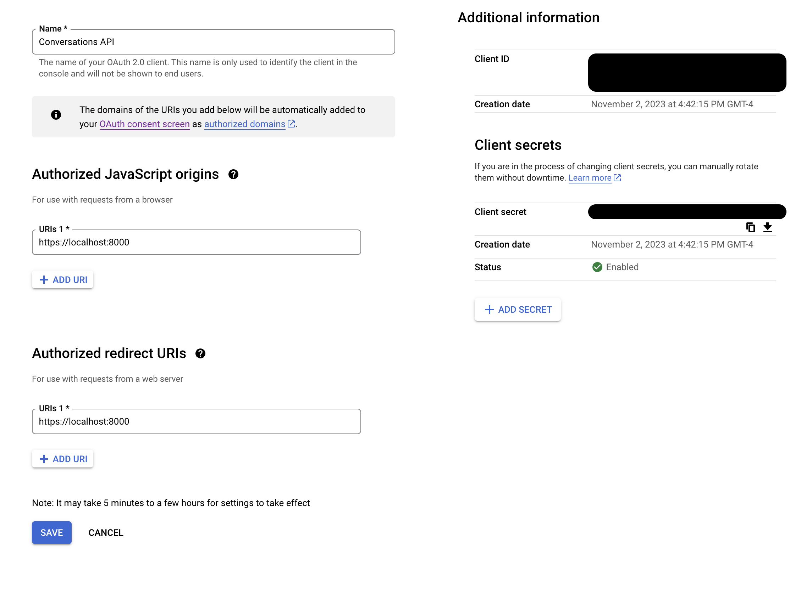
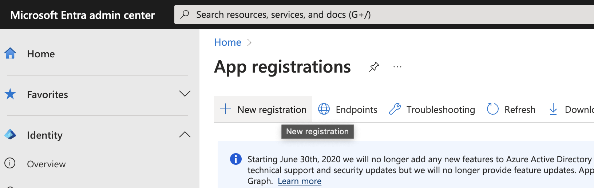
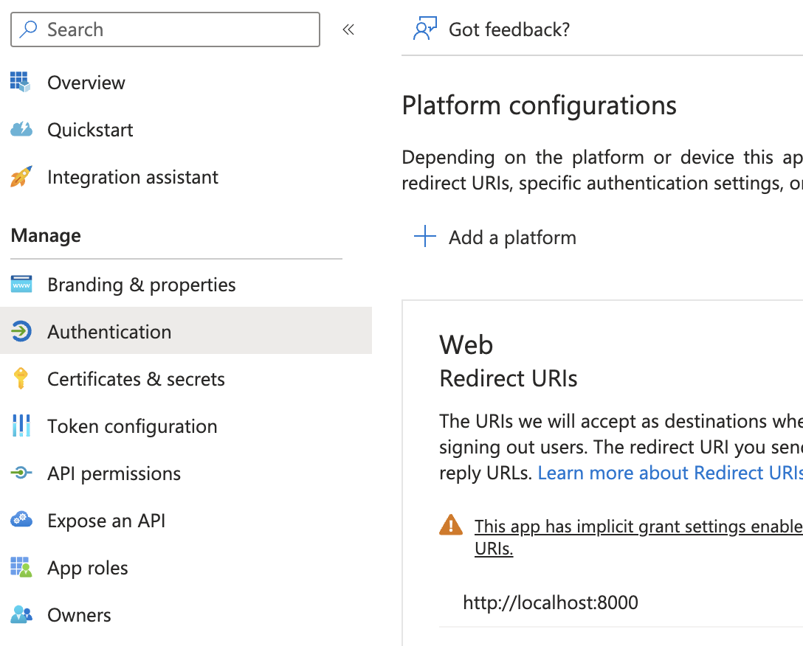
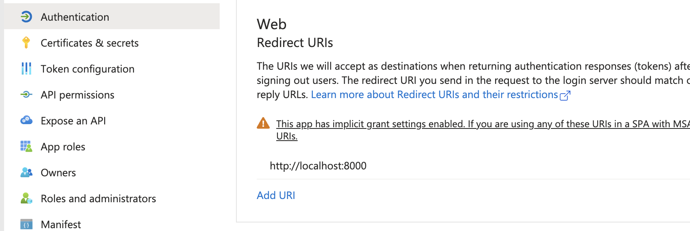
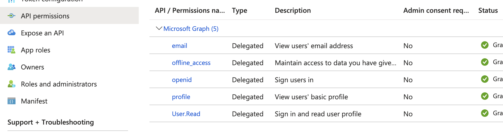

## TOC


## Goal

Allow users to signup to our React Native application using Google or Microsoft. When a user signs up a user account should be created or updated on our Django Application.

## Overview

In Part 1, we’ll setup Django to support social authentication via Google and Microsoft.

In Part 2, we’ll connect our React Native app to Google and Microsoft SSO and our Django API.


---

## Prerequisites

- you have already create a Django App using Django Rest Framework
- you have a React Native App built on Expo

---

## Part 1:  Django

### 1.1 Install Packages

| Package | Django App Name | Documentation |
| ------- | --------------- | ------------- |
| `social-auth-app-django` | `social_django` | <https://python-social-auth.readthedocs.io/en/latest/configuration/django.html> |
| `django-oauth-toolkit` | `oauth2_provider` | <https://github.com/jazzband/django-oauth-toolkit> |
| `drf_social_oauth2` | `drf_social_oauth2` | <https://drf-social-oauth2.readthedocs.io/en/latest/installation.html> |

Your `INSTALLED_APPS` should now have the following Installed Apps:

```python title="settings.py"
INSTALLED_APPS = [
  ...
  "oauth2_provider",
  "social_django",
  "drf_social_oauth2",
  ...
]
```

### 1.2 Create API Client

Follow the DRF Social Oauth Guide to “Setup a New Application” (linked below).

> [!IMPORTANT]
> **Copy & Save `Client secret`**
> Before you hit “Save” copy the Client Secret and Client ID and store them in a safe place. You’ll need them later on, and the Client Secret is hashed on save so you’ll be unable to copy it later.

[Setting Up a New Application — drf-social-oauth2 2.1.3 documentation](https://drf-social-oauth2.readthedocs.io/en/latest/application.html)

### 1.3 Update Social Auth Settings

In `settings.py` add the following options:

```python  title="settings.py"
ACTIVATE_JWT = True
SOCIAL_AUTH_JSONFIELD_ENABLED = True
SOCIAL_AUTH_USERNAME_IS_FULL_EMAIL = True
```

- `ACTIVATE_JWT`

    Access and refresh tokens will be JWTed

    [https://drf-social-oauth2.readthedocs.io/en/latest/installation.html#installation](https://drf-social-oauth2.readthedocs.io/en/latest/installation.html#installation)

- `SOCIAL_AUTH_JSONFIELD_ENABLED`

    When using PostgreSQL, it’s recommended to use the built-in JSONB field to store the extracted `extra_data`.

    [https://python-social-auth.readthedocs.io/en/latest/configuration/django.html#json-field-support](https://python-social-auth.readthedocs.io/en/latest/configuration/django.html#json-field-support)

- `SOCIAL_AUTH_USERNAME_IS_FULL_EMAIL`

    If you want to use the full email address as the `username`, define this setting.

    [https://python-social-auth.readthedocs.io/en/latest/configuration/settings.html#username-generation](https://python-social-auth.readthedocs.io/en/latest/configuration/settings.html#username-generation)

### 1.4 Setup Google OAuth in Django

#### 1.4.1 Create **Application**

1. In [Google Cloud Console](https://console.cloud.google.com/apis/credentials), select your project and go to:
APIs & Services → Credentials → Create Credentials → OAuth client ID
1. Fill in the following settings:
   1. **Application type:** Web application
   2. **Name:** API
   3. **Authorized Javascript origins:**
      1. `https://localhost:<port>`
      2. `<your_prod_domain>`
   4. **Authorized redirect URIs:**
      1. (_The same as Authorized Javascript origins_)





#### 1.4.2 Update Django Settings

Follow the guide here to add support for Google OAuth:

[Integration Social Backends — drf-social-oauth2 2.1.3 documentation](https://drf-social-oauth2.readthedocs.io/en/latest/integration.html#google-integration)

- `SOCIAL_AUTH_GOOGLE_OAUTH2_KEY` value is the `Client ID` of the OAuth2 credential created on Google Cloud Console
- `SOCIAL_AUTH_GOOGLE_OAUTH2_SECRET` value is the `Client Secret` of the OAuth2 credential created on Google Cloud Console

### 1.5 Setup Microsoft OAuth in Django

The settings for Microsoft OAuth are more complicated than setting up for Google. Setup requires overriding one of the serializers (and subsequently a view) provided by DRF Social Auth in order to change a serializer. There may be a better method to do this, but this is what worked for me.

#### 1.5.1 Create **Application**

**Base Application Setup**

1. In [Microsoft Entra](https://entra.microsoft.com/#view/Microsoft_AAD_RegisteredApps/ApplicationsListBlade/quickStartType~/null/sourceType/Microsoft_AAD_IAM) create a new Application
2. Enter the following settings:
    1. **Name:** `<app_name>`
    2. **Supported account types:** Select which types of accounts should be allowed to sign in.
3. Click **Register**



App Registration > New Application



App Registration Page

**Update Settings**

1. Navigate to: **Authentication > Add a platform**
    1. Select **Web**
    2. Enter your Django server hosts (eg. [`http://localhost:8000`](http://localhost:8000/))
2. Under **Implicit grant and hybrid flows** enable both `Access tokens` and `ID tokens`
3. Under **Advanced settings** enable `Allow public client flows`
4. **Save**



**Update Permissions**

1. Navigate to: **API permissions**
2. Ensure you have the following permissions on Microsoft Graph:
    1. `email`
    2. `offline_access`
    3. `openid`
    4. `profile`
    5. `User.Read`



#### 1.5.2 Update **Django Settings**

In settings.py add `social_core.backends.microsoft.MicrosoftOAuth2` to your `AUTHENTICATION_BACKENDS`

```python title="settings.py"
AUTHENTICATION_BACKENDS = (
    "social_core.backends.google.GoogleOAuth2",
    **"social_core.backends.microsoft.MicrosoftOAuth2",**
    "drf_social_oauth2.backends.DjangoOAuth2",
    "django.contrib.auth.backends.ModelBackend",
)
```

This backend uses [https://graph.microsoft.com/v1.0/me](https://graph.microsoft.com/v1.0/me) to fetch the user data given a `access_token`.

#### 1.5.3 Fix Access Token Max Characters Error

By default the `drf_social_oauth2` `ConvertTokenSerializer` limits a token to `2000` characters.

This is bad for Microsoft OAuth, as it returns a token larger than 2000 characters. In order to prevent an error later on, let’s update the ConvertTokenSerializer now.

**Override ConvertTokenSerializer**

In my case, I have an app called `authentication` in my project, which houses views and models related to auth (eg. my custom `User` model). Update your app `views.py` to have the following:

```python title="views.py"
from rest_framework import serializers
from drf_social_oauth2.serializers import ConvertTokenSerializer as BaseConvertTokenSerializer
from drf_social_oauth2.views import ConvertTokenView as BaseConvertTokenView

**class ConvertTokenSerializer(BaseConvertTokenSerializer):
    token = serializers.CharField(max_length=3000)**

class ConvertTokenView(BaseConvertTokenView):
    def post(self, request: Request, *args, **kwargs):
        **serializer = ConvertTokenSerializer(data=request.data)**
        serializer.is_valid(raise_exception=True)
        # Use the rest framework `.data` to fake the post body of the django request.
        request._request.POST = request._request.POST.copy()
        for key, value in serializer.validated_data.items():
            request._request.POST[key] = value

        try:
            url, headers, body, status = self.create_token_response(request._request)
        except InvalidClientError:
            return Response(
                data={'invalid_client': 'Missing client type.'},
                status=HTTP_400_BAD_REQUEST,
            )
        except MissingClientIdError as ex:
            return Response(
                data={'invalid_request': ex.description},
                status=HTTP_400_BAD_REQUEST,
            )
        except InvalidRequestError as ex:
            return Response(
                data={'invalid_request': ex.description},
                status=HTTP_400_BAD_REQUEST,
            )
        except UnsupportedGrantTypeError:
            return Response(
                data={'unsupported_grant_type': 'Missing grant type.'},
                status=HTTP_400_BAD_REQUEST,
            )
        except AccessDeniedError:
            return Response(
                {'access_denied': f'The token you provided is invalid or expired.'},
                status=HTTP_400_BAD_REQUEST,
            )

        return Response(data=json_loads(body), status=status)
```

**Update your application `urls.py`**

```python title="urls.py"
from django.urls import include, re_path
from oauth2_provider.views import AuthorizationView
from drf_social_oauth2.views import (
    TokenView,
    RevokeTokenView,
    InvalidateSessions,
    InvalidateRefreshTokens,
)
from .views import ConvertTokenView

auth_urlpatterns = (
    [
        re_path(r'^authorize/?$', AuthorizationView.as_view(), name='authorize'),
        re_path(r'^token/?$', TokenView.as_view(), name='token'),
        re_path(r'^convert-token/?$', ConvertTokenView.as_view(), name='convert_token'),
        re_path(r'^revoke-token/?$', RevokeTokenView.as_view(), name='revoke_token'),
        re_path(
            r'^invalidate-sessions/?$',
            InvalidateSessions.as_view(),
            name='invalidate_sessions',
        ),
        re_path(
            r'^invalidate-refresh-tokens/?$',
            InvalidateRefreshTokens.as_view(),
            name='invalidate_refresh_tokens',
        ),
        re_path('', include('social_django.urls', namespace='social')),
    ],
    "drf",
)
```

**Update your project `urls.py`**

```python title="urls.py"
import authentication.urls
urlpatterns = [
  ...
  re_path(r"^auth/", include(authentication.urls.auth_urlpatterns)),
]
```

---

> [!IMPORTANT]
> 🎉 **Whew 😮‍💨😌 you’ve completed Part 1! You now have a Django API capable of authenticating users via Google and Microsoft.**
> Next up: In Part 2 we setup your React Native App to connect with the Django backend and Google/Microsoft SSO

---

## Part 2: React Native

### 2.1 Install Packages

Install [Expo AuthSession](https://docs.expo.dev/versions/latest/sdk/auth-session/)

[AuthSession](https://docs.expo.dev/versions/latest/sdk/auth-session/)

Install [Expo Web Browser](https://docs.expo.dev/versions/latest/sdk/webbrowser/)

[WebBrowser](https://docs.expo.dev/versions/latest/sdk/webbrowser/)

Install [axios](https://axios-http.com/)

[Axios](https://axios-http.com/)

### 2.2 Warm Web Browser & Setup State

```tsx
import * as React from 'react';
import axios from "axios";
import * as WebBrowser from 'expo-web-browser';
import { Button, Text, SafeAreaView, Platform } from 'react-native';

WebBrowser.maybeCompleteAuthSession();

export default function App() {
  // We store the JWT in here
  const [token, setToken] = React.useState<string | null>(null);

  React.useEffect(() => {
    if (Platform.OS === "web") {
      return;
    }

    WebBrowser.warmUpAsync();

    return () => {
      if (Platform.OS === "web") {
        return;
      }

      WebBrowser.coolDownAsync();
    };
  }, []);

  return (
    <SafeAreaView>
      <Text>{token}</Text>
    </SafeAreaView>
  );
}
```

### 2.3  Setup Google OAuth in React Native

#### 2.3.1 Update Google Cloud Console

Navigate to **APIs & Services > Credentials**, and create three new OAuth Clients with the following Application Types and settings:

- **iOS**
  - Set **Bundle Id** to the value defined in `app.json` `ios.bundleIdentifier`
- **Android**
  - Set **Package name** to the value defined in `app.json` `android.package`
  - Get your **SHA-1 certificate fingerprint** from [expo.dev](https://expo.dev/)
    - In [expo.dev](http://expo.dev) Select your project
    - Navigate to **Credentials > Android**
    - Select your package
    - Use the value defined in `SHA-1 Certificate Fingerprint`
- **Web**
  - Set Authorized Redirect URLs to your react native web hosts:
    - e.g. [http://localhost:8081](http://localhost:8081/)

#### 2.3.2  Connect Google OAuth

**Update Imports**

```tsx
import * as Google from "expo-auth-session/providers/google";
```

**Add Google OAuth Support**

For `clientId`, `iosClientId`, and `androidClientId`, use the Clients IDs from the OAuth Clients you created above.

```tsx
export default function App() {
	const [, googleResponse, googlePromptAsync] = Google.useAuthRequest({
	  clientId: GOOGLE_AUTH_CLIENT_ID_WEB,
	  iosClientId: GOOGLE_AUTH_CLIENT_ID_IOS,
	  androidClientId: GOOGLE_AUTH_CLIENT_ID_ANDROID,
	});
	...
}
```

**Connect a Button to the Google OAuth Prompt**

Update your template to include a button to trigger the Google Prompt

```tsx
return (
    <SafeAreaView>
			<Button
				title="Continue with Google"
				onPress={googlePromptAsync}
			/>
      <Text>{token}</Text>
    </SafeAreaView>
);
```

**Handle Google Auth Complete**

When the Google Prompt is successful, get the `access_token`returned by Google, and send it to our Django API backend to convert to a Django Social Auth `access_token`

For `DJANGO_API_CLIENT_ID` and `DJANGO_API_CLIENT_SECRET` use the values you copied earlier when you Created the Social Auth API Client (see: [1.2 Create API Client ](django-react-native-auth.md))

Save the token returned by the Django API, this token can be used later on as an `Authorization` header on axios.

```tsx
export default function App() {
	...
	useEffect(() => {
	  if (googleResponse?.type !== "success") {
	    return;
	  }

	  axios
			.post(
				"<django-api-host>/auth/convert-token/",
	      {
	        grant_type: "convert_token",
	        backend: "google-oauth2",
	        client_id: DJANGO_API_CLIENT_ID,
	        client_secret: DJANGO_API_CLIENT_SECRET,
	        token: googleResponse.params.access_token,
	      },
	      {
	        headers: { Accept: "application/json" },
	      },
	   )
			.then((djangoAPIResponse) => {
				setToken(djangoAPIResponse.data.access_token)
			});
	}, [googleResponse]);
}
```

### 2.4 Setup Microsoft OAuth in React Native

#### 2.4.1 Update Application in Microsoft Entra Admin Center

Return to the Microsoft Entra Admin Center, and update the Application you created earlier.

Under the `Authentication` section add new redirect urls for:

- `Single-page application`
    - Add urls for your react native **web** application (eg. [http://localhost:8081/](http://localhost:8081/auth))
- `Mobile and desktop applications`
    - Add redirect urls for your react native **ios and android** apps using your app scheme (eg. app_scheme://)
    - You can find your `app_scheme` in `app.json` > `scheme` field.
    -


#### 2.4.2 Connect Microsoft OAuth

**Update Imports**

```jsx
import {
  exchangeCodeAsync,
  makeRedirectUri,
  useAuthRequest,
  useAutoDiscovery,
} from 'expo-auth-session';
```

**Add Microsoft OAuth Support**

- Set `MICROSOFT_TENANT_ID` use your Microsoft Tenant ID or `common`
- Set `MICROSOFT_AUTH_CLIENT_ID` to your Application Client ID
    - In the Microsoft Entra Admin Center: Select your Application > Overview > Essentials > `Application (client) ID`

```tsx
export default function App() {
	...
	const microsoftDiscovery = useAutoDiscovery(
    `https://login.microsoftonline.com/${MICROSOFT_TENANT_ID}/v2.0`,
  );
  const microsoftRedirectUri = makeRedirectUri({
    scheme: undefined,
    path: "auth",
  });
	const [microsoftRequest, microsoftResponse, microsoftPromptAsync] =
    useAuthRequest(
      {
        clientId: MICROSOFT_AUTH_CLIENT_ID,
        scopes: ["openid", "profile", "email", "offline_access"],
        redirectUri: microsoftRedirectUri,
      },
      microsoftDiscovery,
    );
	...
}
```

**Connect a Button to the Google OAuth Prompt**

Update your template to include a button to trigger the Google Prompt

```tsx
return (
    <SafeAreaView>
			<Button
				title="Continue with Google"
				onPress={googlePromptAsync}
			/>
			<Button
				title="Continue with Microsoft"
				onPress={microsoftPromptAsync}
			/>
      <Text>{token}</Text>
    </SafeAreaView>
);
```

**Handle Microsoft Auth Complete**

For Microsoft auth, we need to convert the code returned to an access token, and then pass *that* token along to our Django API.

As with Google Auth, for `DJANGO_API_CLIENT_ID` and `DJANGO_API_CLIENT_SECRET` use the values you copied earlier when you Created the Social Auth API Client (see: [1.2 Create API Client ](django-react-native-auth.md))

Save the `access_token` returned by the Django API in a state (or store), this token can be used later on as an `Authorization` header on axios.

```tsx
export default function App() {
	...
	useEffect(() => {
    if (
      !microsoftRequest ||
      !microsoftDiscovery ||
      microsoftResponse?.type !== "success"
    ) {
      return;
    }

		exchangeCodeAsync(
      {
        clientId: Config.MICROSOFT_AUTH_CLIENT_ID,
        code: microsoftResponse.params.code,
        extraParams: microsoftRequest.codeVerifier
          ? { code_verifier: microsoftRequest.codeVerifier }
          : undefined,
        redirectUri: microsoftRedirectUri,
      },
      microsoftDiscovery,
    ).then((microsoftExchangeRes) => {
			axios
				.post(
					"<django-api-host>/auth/convert-token/",
		      {
		        grant_type: "convert_token",
		        backend: "microsoft-graph",
		        client_id: DJANGO_API_CLIENT_ID,
		        client_secret: DJANGO_API_CLIENT_SECRET,
		        token: microsoftExchangeRes.accessToken,
		      },
		      {
		        headers: { Accept: "application/json" },
		      },
		   )
				.then((djangoAPIResponse) => {
					setToken(djangoAPIResponse.data.access_token)
				});
    });
  }, [microsoftResponse]);
}
```
