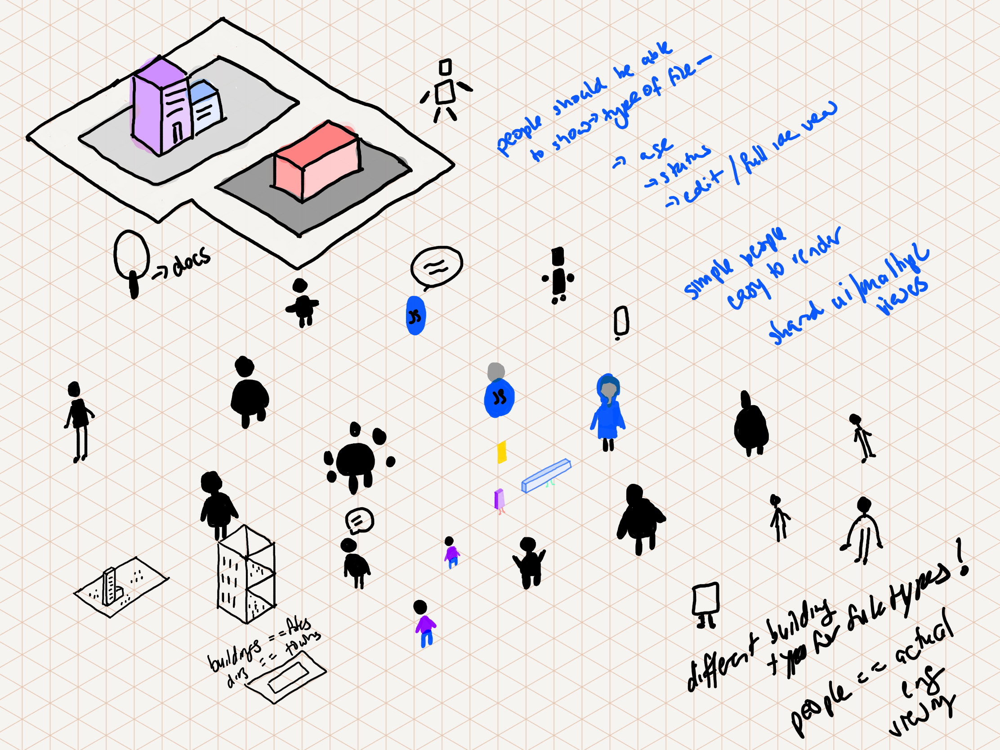
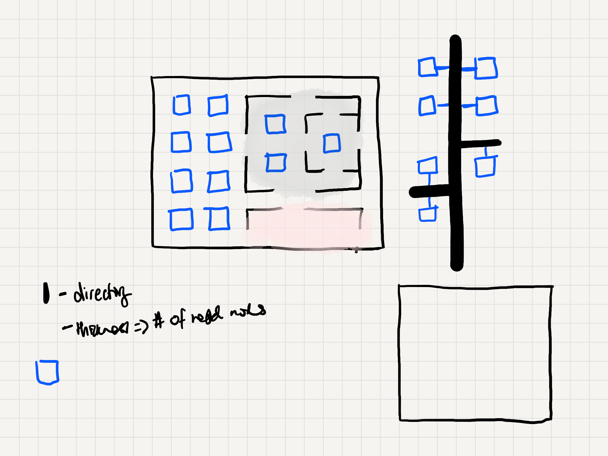
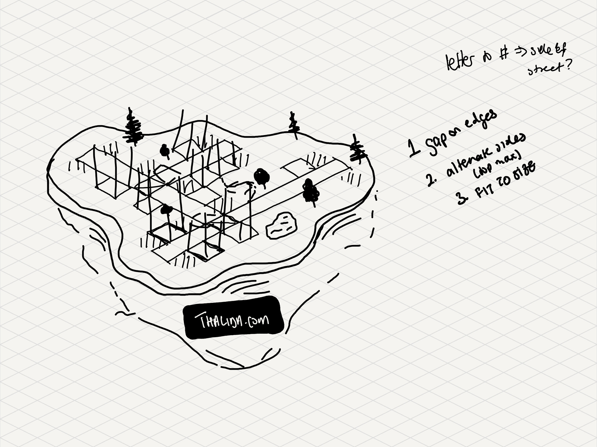

| Links | |
| ------ | ------- |
| [Github →](https://github.com/thalida/codecity) | |

## ✅ Todos

- [ ]  Buy / Create 3D buildings
- [ ]  Update site performance
- [ ]  Take screenshots to update notion build log

## 🧠🌩 Brainstorm

### City Generation

#### **BUILDINGS**

- Buildings age based on the age of the file
  - eg. A modern building for a new file
  - eg. A victorian building for a an old file
- Grime / damage on a building based on last modified date
  - the cleaner the building the most recently the file was updated
- The style / type of building is based on the type of file
  - eg. a readme could be a library?

#### **STREETS**

- Each street is the name of a folder
- The width of the street is based on the number of files / directories nested in it

## 🎨 Design

### Inspiration

[Code City by Thalida Noel](https://dribbble.com/thalida/collections/2030629-Code-City)

### Paper Sketches

| | |
| ------ | ------- |
|  |  |
|  | |
