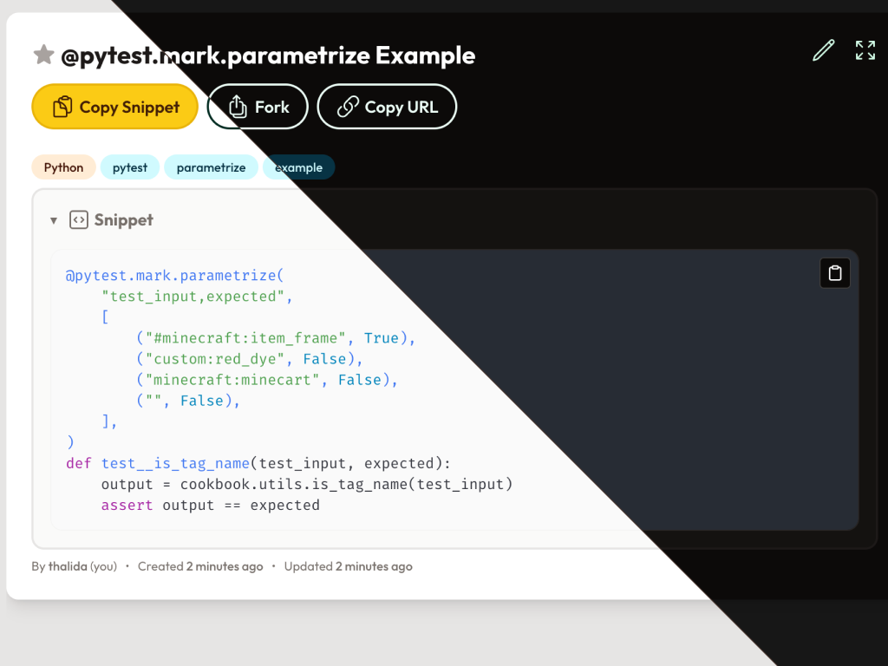

| Links | | |
| ------ | ------- | ------- |
| [GitHub →](https://github.com/xtream1101/devscript) | [Website →](https://devscript.host) |  [Docs →](https://docs.devscript.host) |

> [!IMPORTANT]
> This projects was completed by both [xtream1101](https://github.com/xtream1101/) and myself

## ⚡️ Project Overview

A snippet and script management tool.

Use for free at [devscript.host](https://devscript.host)
or self-host it yourself using the [Quick Start Guide](#-quick-start-guide)

Additional documentation can be found at [docs.devscript.host](https://docs.devscript.host)

---

## 📦 Features

- **SSO Support** - Nine (9) different providers, including a generic option, are supported.
  - _Email/Password registration is also available._
- **CLI Integration** - Run your own snippet on the command line (TODO: link to docs on how to set this up)
- **Advanced search** - Search by title, description, tags, or code content.
- **Tags** - Organize your snippets with tags
- **Discover Snippets** - Explore public snippets shared by other users.
- **Forking** - Fork a snippet to make it your own.
- **Favorites** - Save your favorite snippets for easy access.
- **Syntax highlighting and more** - Code snippets are syntax highlighted for easy reading. Markdown is supported for descriptions.

---

## 🚀 Quick Start Guide

### Running via docker-compose

1. Clone this repository
2. Copy the `.env.example` file to `.env` and fill in the required environment variables
    - Configuration options: <https://docs.devscript.host/guides/self-hosting/configuration/>
3. Run `docker compose up` to start the application
4. Access the application at <http://localhost:8000>

---

## 📝 Upcoming features

- VSCode extention to manage snippets directly in the editor

## 💬 Report a Bug or Feature Request

If you encounter any issues or have suggestions for improvements, file a new issue on our [GitHub issues page](https://github.com/xtream1101/devscript/issues).

If you find a security vulnerability, please do not create an issue. Instead, contact the maintainers directly at [security@devscript.host](mailto:security@devscript.host)

## 🛠️ Development

If you would like to contribute to the project, please refer to the [development guide](https://docs.devscript.host/reference/development/).

## 📜 License

This project is licensed under the [GPLv3](LICENSE).
