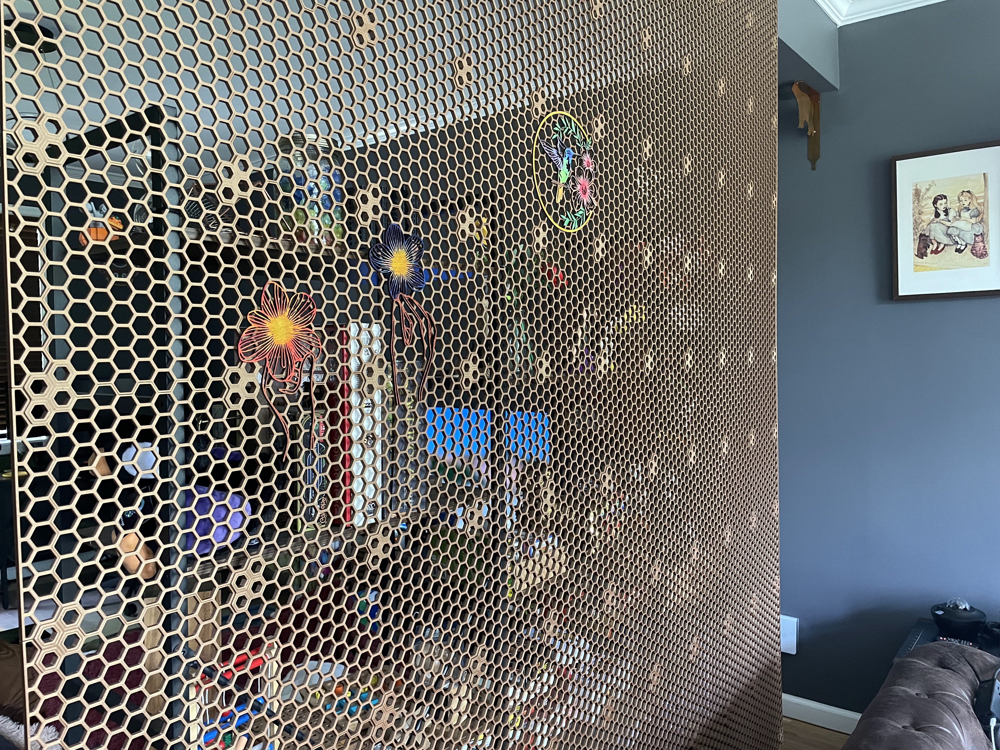
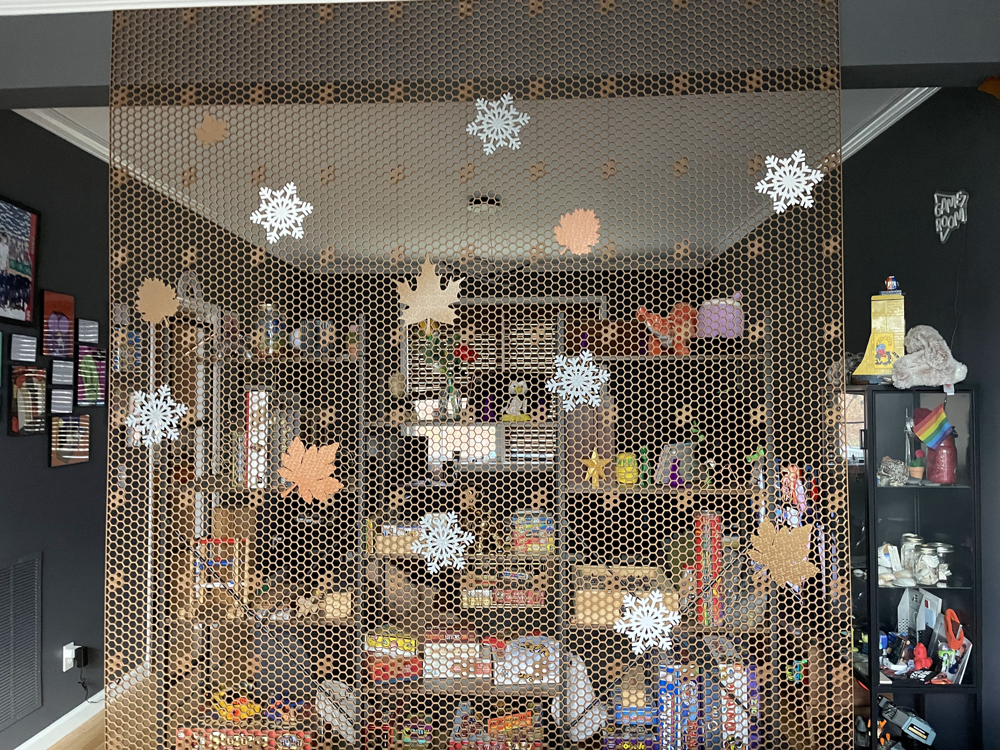

For this space I wanted to create a divider wall to separate the two spaces. I intially thought about using a bookshelf,
but it didn't provide as much separation as I wanted.

After looking at options I could buy, and finding them too expensive, I decided to create a 3D printed divider wall using
the [Honeycomb Storage System (HSW)](https://www.printables.com/model/152592-honeycomb-storage-wall).

_(I won't do the math on the $$$ I spent on fillament instead of buying lolol)_

Because I used the HSW system, I'm now able to add season decorations, or change the look of the wall by adding
different panels. I can also add shelves, or other items to the wall.
