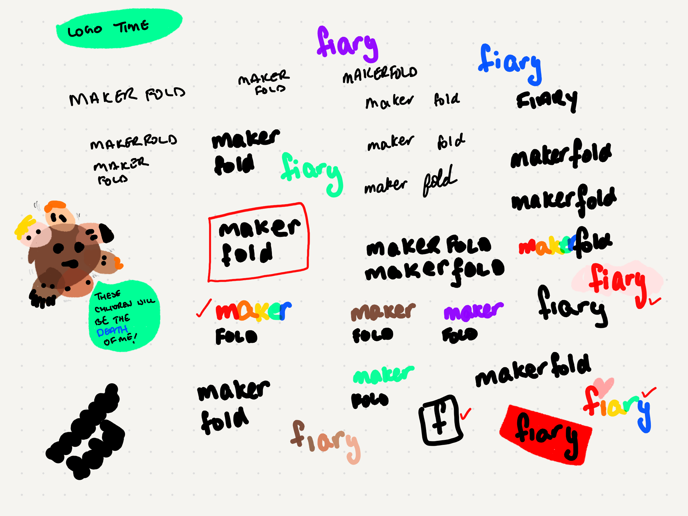
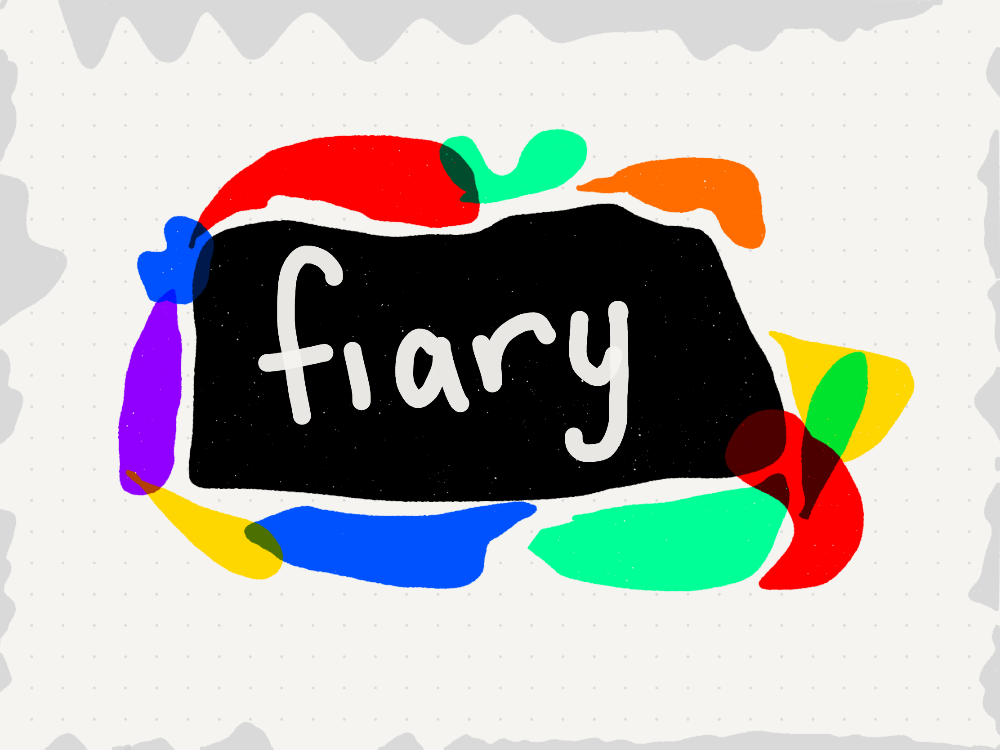
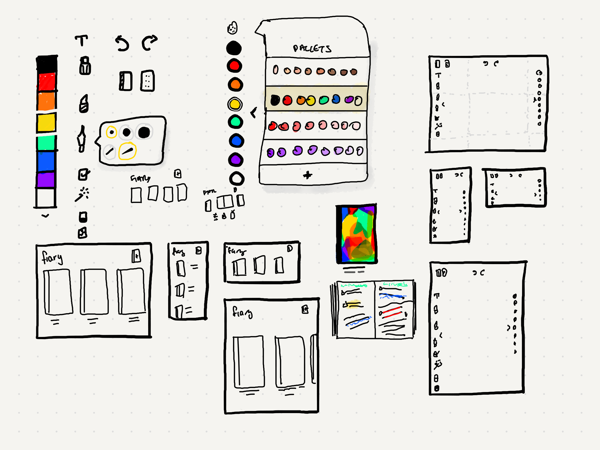

| Links | |
| ------ | ------- |
| [Github →](https://github.com/thalida/fiary) | |

<video width="320" height="240" controls>
  <source src="/public/content/projects/fiary/export_1670527862768.mov" type="video/mp4">
</video>

## Idea

A digital bullet journal. A tool that’s a hybrid of notion + paper.

## Helpful Resources

- [HTML Canvas - Apple Pencil / 3D Touch API](https://codesandbox.io/embed/qr4uq?codemirror=1)
- [how to draw smooth curve through N points using javascript HTML5 canvas?](https://stackoverflow.com/questions/7054272/how-to-draw-smooth-curve-through-n-points-using-javascript-html5-canvas)

## Brainstorm

### Name Exploration

### Colors & Icon Exploration

| | |
| ------ | ------- |
|  |  |
|  | |

## Design

### Inspiration

- [fiary. v3 by Thalida Noel](https://dribbble.com/thalida/collections/1958939-fiary-v3)
- [fiary v2 by Thalida Noel](https://dribbble.com/thalida/collections/1601055-fiary-v2)
- [Notes & Todos by Thalida Noel](https://dribbble.com/thalida/collections/967810-Notes-Todos)
- [fiary thalida by Thalida Noel](https://dribbble.com/thalida/collections/2146817-fiary-thalida)

### Paper Sketches

