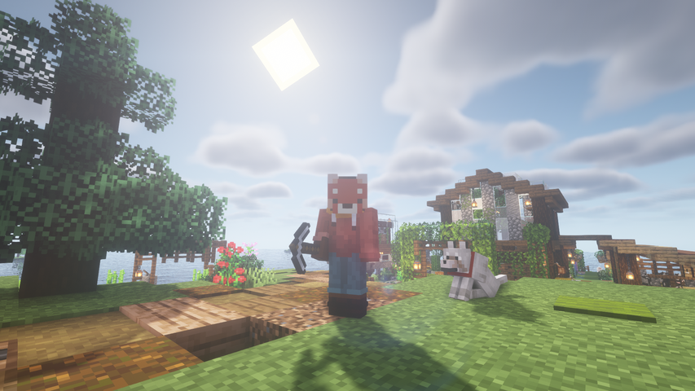

| Links | |
| ------ | ------- |
| [Github →](https://github.com/thalida/grindless) | [Docs →](http://docs.grindless.builders/) |

## ✅ ToDo

- [ ]  Improve performance, the datapack *works* but causes hella lag
- [ ]  Rate limit it so you can’t spam the button.

## 🧠🌩 Brainstorm

A new mode for Minecraft that’s a combo of survival and creative. Where you place a button down in any biome and whenever you press it it gives you the items for the biome.
