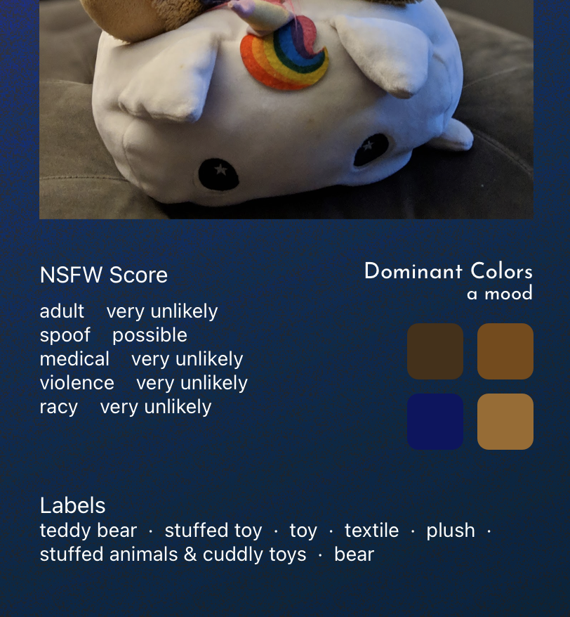
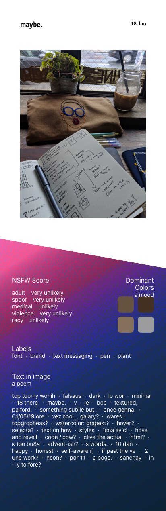
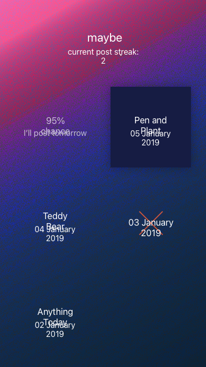
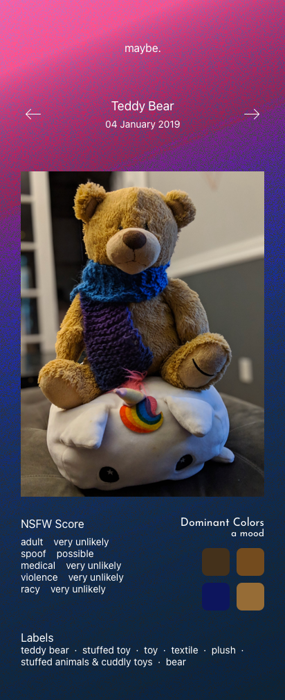

An analysed aggregated feed of my social media activity.

[Github →](https://github.com/thalida/maybe.social)

## 🧠🌩 Brainstorm

- Use sentiment analysis to describe my social media posts
- Automatically pull dominant colors from photos (and analyze over time?)

## 🎨 Design

### Mockups

**V1**

**V2**

