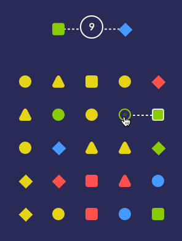
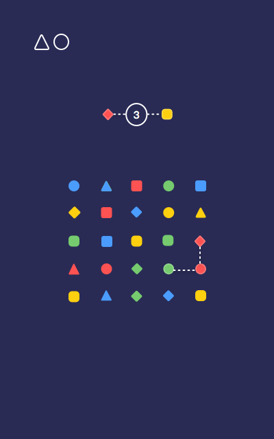
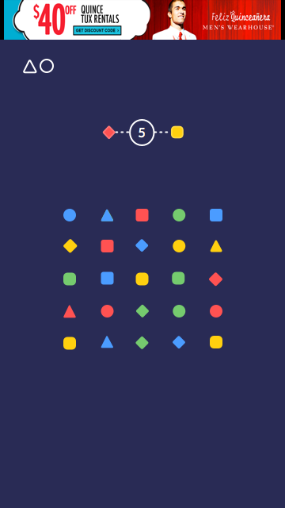
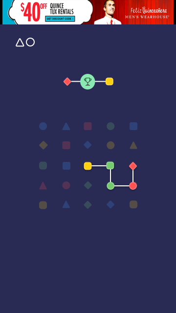
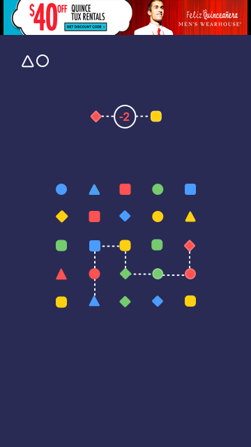

A puzzle game where the goal is to get from one shape to another in a specified amount of moves.

[Github →](https://github.com/thalida/ShapeConnector)   [Website →](http://thalida.github.io/shapeconnector/)

## 🎨 Design

### Inspiration

[ShapeConnector 2.0 by Thalida Noel](https://dribbble.com/thalida/collections/601739-ShapeConnector-2-0)

### Mockups

