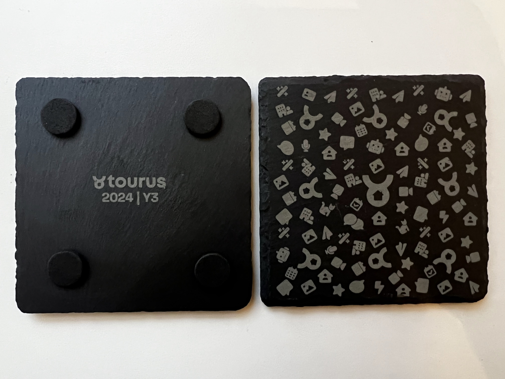

To celebrate the 3rd anniversary of Tourus, I designed and 3D printed coasters that represent the journey of the company.

The coaster features the Tourus logo and icons representing key product milestones.
If you look closely, you'll also see cats, on the Tourus journey our cats  served as our moral support
and unofficial mascots for company.

I desgined the coasters in Figma, exported them as an SVG, and then engraved them using my laser cutter.

<video width="320" height="240" controls>
  <source src="/public/content/projects/tourus-y3-coasters/IMG_2899~2.mp4" type="video/mp4">
</video>
