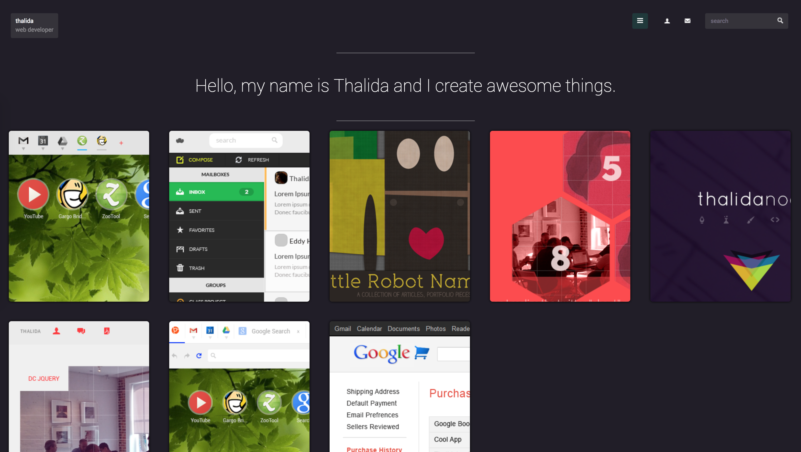

**A short lived version of my site that featured flat cards, because that's all the rage**

**active:**

Jan 2013 → Mar 2013

**www:**

[Github →](https://github.com/thalida/thalida.com/tree/v-2013-1)   [View Live →](https://2013-1.v.thalida.com)

## Designs

### Landing Page

During this time period I struggled with finding my balance between minimal “clean” pages and content-rich. (something I still struggle with to this day.)

### Project View

Intended to be a modal in order for the site to still be considered a “one-pager”.

### About

The base setup of the about section with bars for various skill levels, the actual implementation took this concept and made it a lot more colorful.

## Abandoned Iterations

This folded-shadow look was all the rage for a while, and I created a mockup of what my current site would be if I recreated it using the web-fads of the day.
