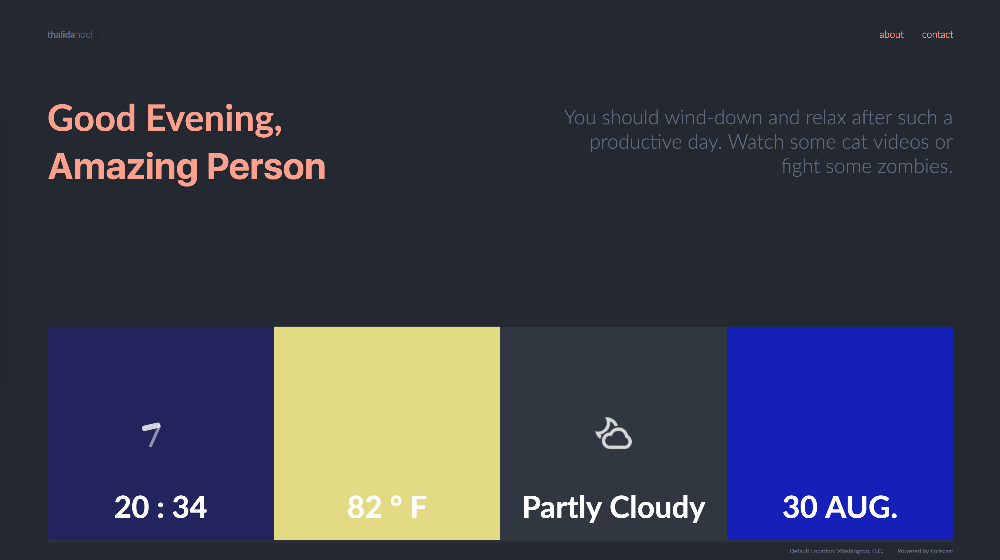

| **Year(s)** | **GitHub** | **Link** |
| ----------- | --------- | -------- |
| March 2013 - January 2014 | [Github →](https://github.com/thalida/thalida.com/tree/v-2013-2)  | [View Live →](https://2013-2.v.thalida.com) |

## Story

The first of my “live” sites, this site inspired a lot of my future updates and work. I wanted to create a site that was dynamic for each visitor. That goal has stuck with me ever since.

It’s very interesting to me how a lot of the designs in 2013 onward stand up to the test of time, and no-one would really blink if I showed these concepts around as ideas for the next version of this site.

## Concepts

## “Final” Designs

Somewhere between these concepts and the final designs below I made a very drastic switch back to something very card based. I probably lost some designs along the way sadly.

