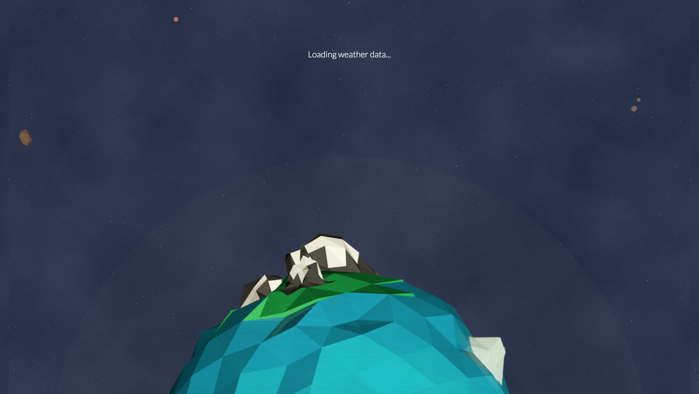

| **Year(s)** | **GitHub** | **Link** |
| ----------- | --------- | -------- |
| January 2014 - January 2015 | [Github →](https://github.com/thalida/thalida.com/tree/v-2014) | [View Live →](https://2014.v.thalida.com) |

> [!NOTE]
> ⚠️ I abandoned this design and stuck with my current site of the time.

## Story

I had high-hopes of creating a version of my site with detailed case-studies for my various projects.
I came up with the mocks shown below, and started coding. I quickly realized it was too soon to create
a site of this kind: I didn’t have that many completed projects.

## Designs

