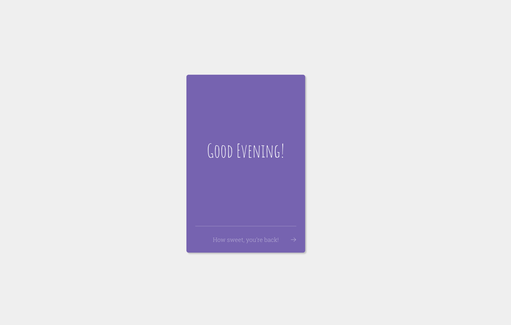
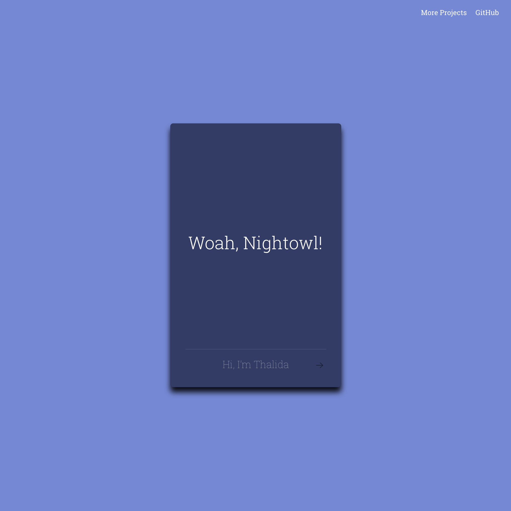

**A floating card (that flips over) with live time data**

**active:**

Jan 2015 → Aug 2016

**www:**

[Github →](https://github.com/thalida/thalida.com/tree/v-2015)   [View Live →](https://2015.v.thalida.com)

## Story

I had two goals for this site:

1. A try at a super minimal site, that gave just enough information to let the visitor know what I was all about
2. Create a design with *just* enough components so that I could rebuild the site in a variety of frontend frameworks (as a learning experience)

## Design

## How it Works

This version of the site was built using [AngularJS](https://angularjs.org/), bower, and gulp. The card color and greeting text is based on the current time of day.
