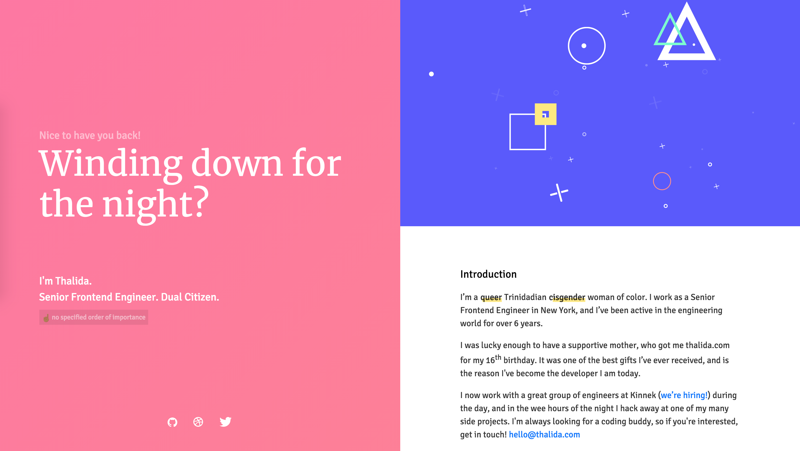
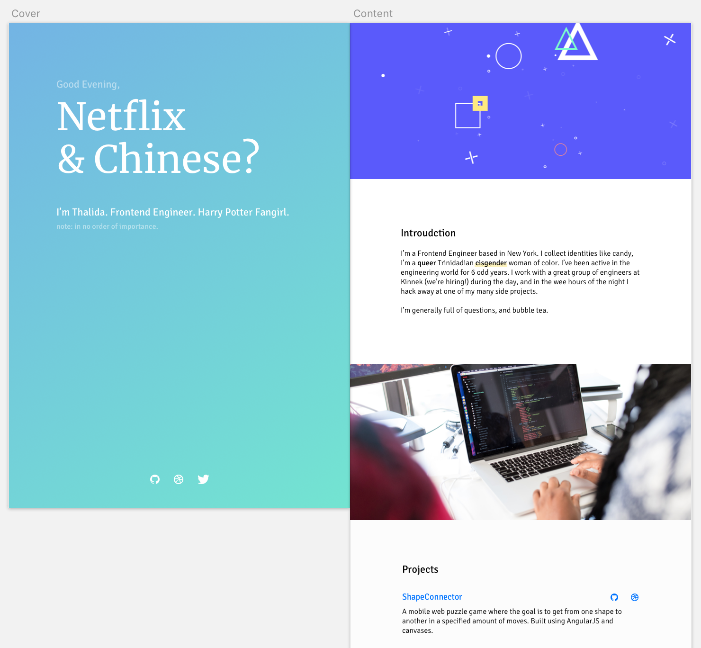

| **Year(s)** | **GitHub** | **Link** |
| ----------- | --------- | -------- |
| August 2016 - March 2017 | [Github →](https://github.com/thalida/thalida.com/tree/v-2016) | [View Live →](https://2016.v.thalida.com) |

## Story

After having the floating card design for a while, I wanted to move away from a very simplified site, and create something a bit more complicated. I knew I wanted it to be a one page site, and that I wanted to play around with color again.

## Design

## How it Works

The site was built using [AngularJS](https://angularjs.org/).

### Live Gradient

The gradient and welcome text is based on the current time for the visitor.

### Visits

The salutation is also based on the number of visits, your first visit may say “Welcome”, the next “Hello again”, and it’ll keep changing based on how often you visit.

### Interactive Element

In the past I’ve played around with interactive elements on my sites, I wanted to do that again here (also as part of the challenge), so I created a simple interactive element that moves as your mouse drags over the image.

It has a subtle parallax effect, with the shapes closer to the front moving faster than the shapes towards the back.
