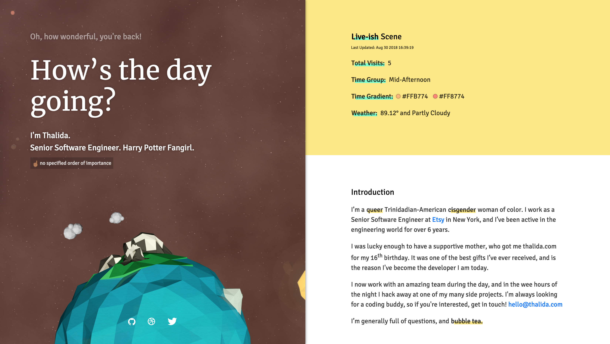
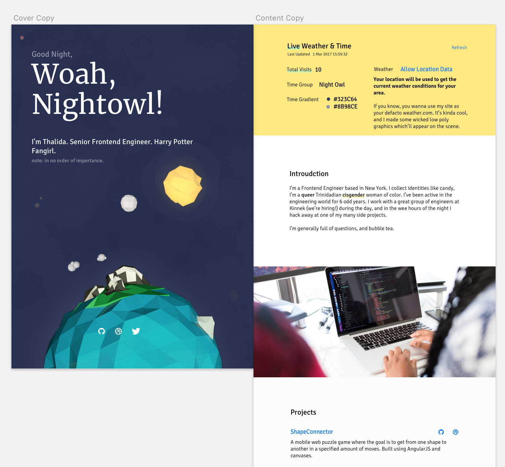

| **Year(s)** | **GitHub** | **Link** |
| ----------- | --------- | -------- |
| March 2017 - December 2017 | [Github →](https://github.com/thalida/thalida.com/tree/v-2017-1) | [View Live →](https://2017-1.v.thalida.com) |

## Story

After creating the first split screen version ([Color Split](Color%20Split%20845cf31e264142cbb1c6977f9aa83a1d.md) ), I wanted to push myself and actually implement the lowpoly space scene with weather that I’d previously abandoned in [Full­screen Low­poly](Full%C2%ADscreen%20Low%C2%ADpoly%204f9eddf446cb4d46bbbe5bf85cad60ab.md).

## Design

This is one of those times where the final results almost perfectly match the mockup.

## How it Works

### Live Sun & Moon

The sun and moon rotate around the earth based on the current time, yes this is a very Geocentric model of how the solar system works. The color of space also changes throughout the day.

### Weather

I fetch the weather data using [DarkSky](https://darksky.net/poweredby/), and it’s displayed animated floating above the earth.

### Illustrations

I created all of the images used in the scene with [Maxon3D](https://www.maxon.net/en-us/), they were previously created for an older version of the site that I abandoned ([Full­screen Low­poly](Full%C2%ADscreen%20Low%C2%ADpoly%204f9eddf446cb4d46bbbe5bf85cad60ab.md))
