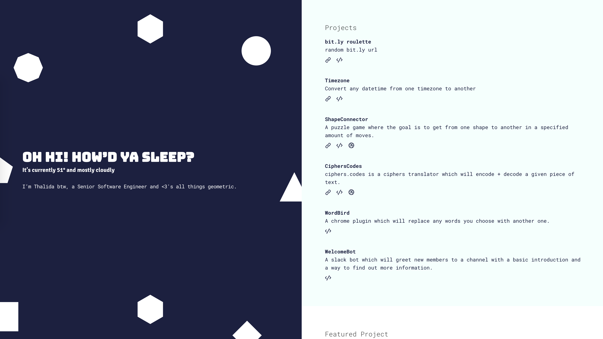
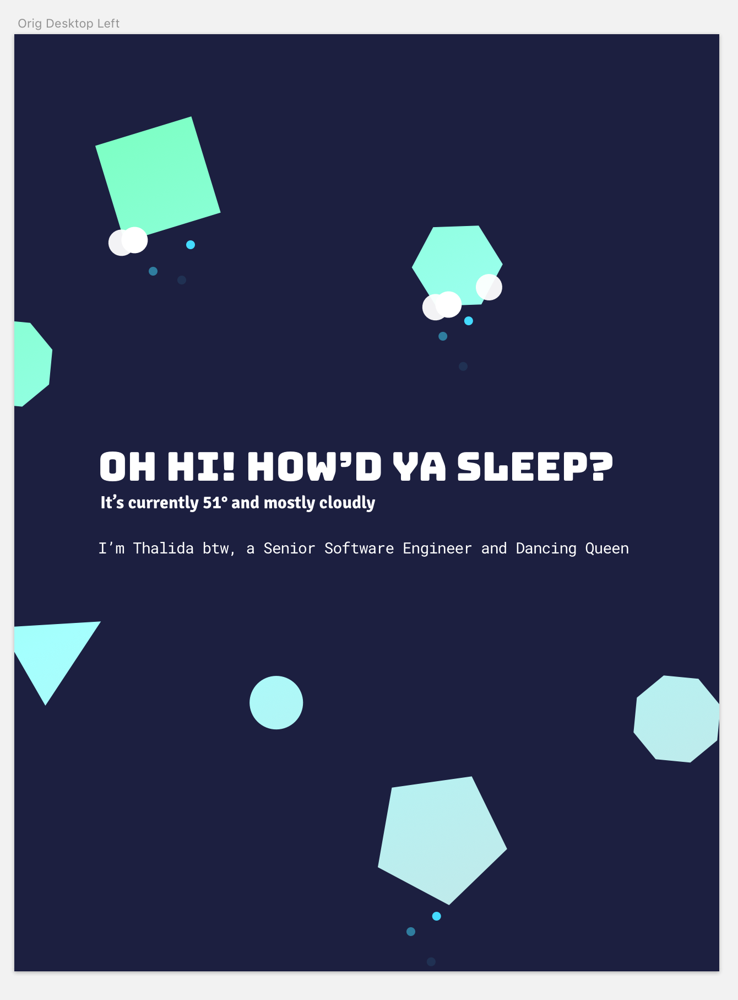

| **Year(s)** | **GitHub** | **Link** |
| ----------- | --------- | -------- |
| December 2017 - January 2018 | [Github →](https://github.com/thalida/thalida.com/tree/v-2017-2) | [View Live →](https://2017-2.v.thalida.com) |

## Story

My initial concept for [#newwwyear](https://twitter.com/jensimmons/status/943305744123916288), but once I started implementing it I wasn’t entirely happy with how it looked and switched to [Space Calendar](Space%20Calendar%20825ae7255e084572a394ebe10de09b5e.md).

The idea was that the shapes would rotate based on the time of day, and some of the visible shapes would mimic the current weather.

## Mockup

