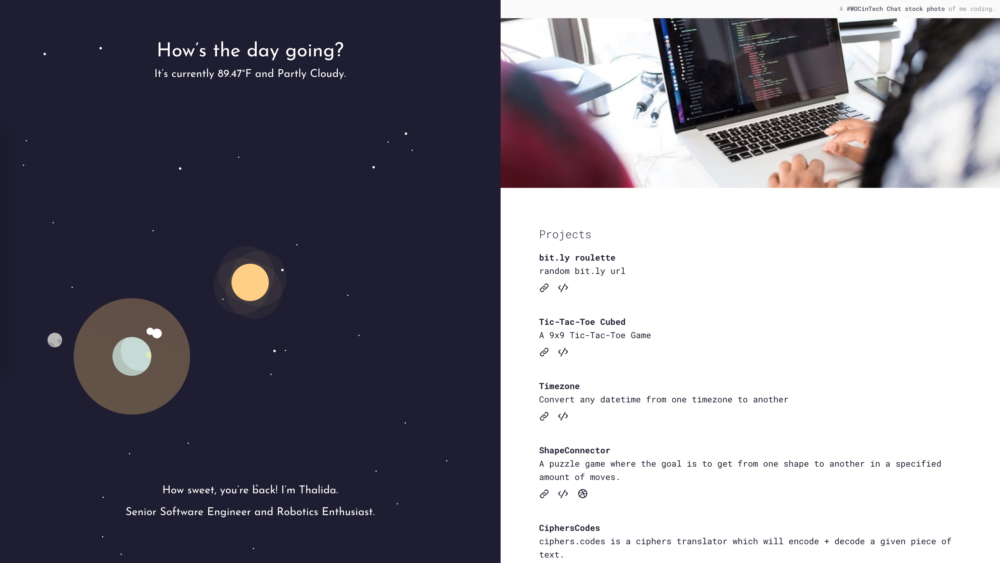
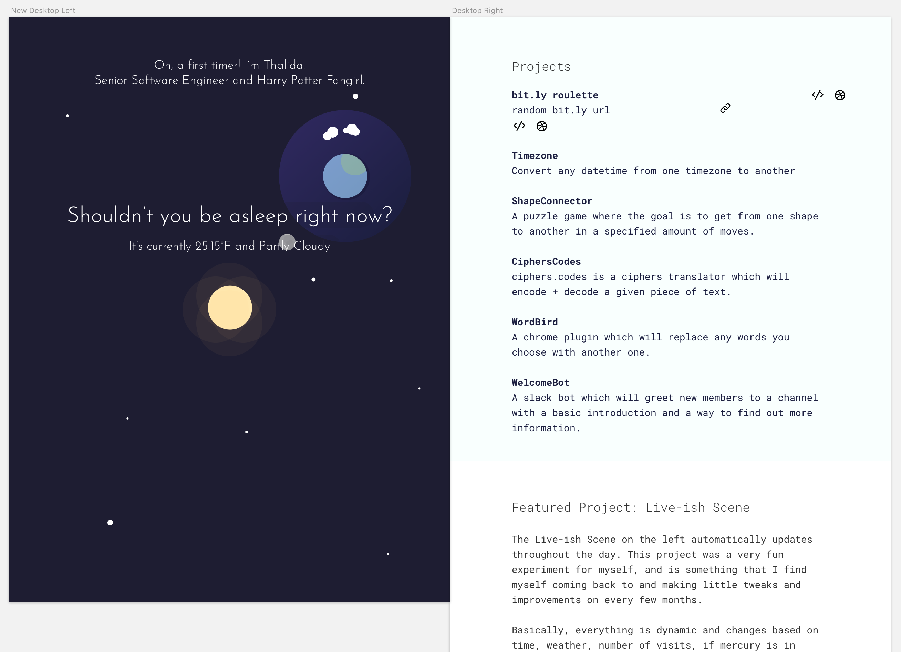
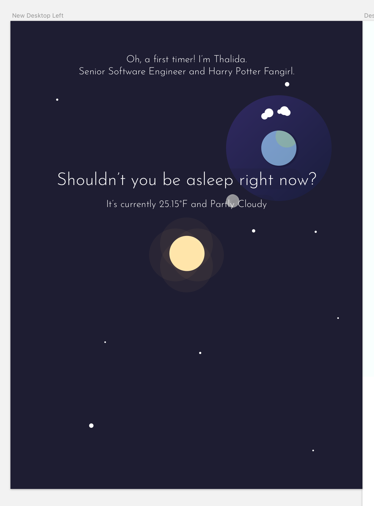

| **Year(s)** | **GitHub** | **Link** |
| ----------- | --------- | -------- |
| January 2018 - August 2018 | [Github →](https://github.com/thalida/thalida.com/tree/v-2018-1) |  [View Live →](https://2018-1.v.thalida.com) |

## Story

For [#newwwyear](https://twitter.com/jensimmons/status/943305744123916288) I wanted to participate by updating my site. I’d initially planned to update the left side to [Shape Clock](Shape%20Clock%204afb7485cd1b451c9daa031b8d2e8d97.md), but I abandoned that and moved towards this version: a lowpoly space calendar *and* clock.

## Design

## How it works

The site was built using [Vue](https://vuejs.org/) and the [DarkSky](https://darksky.net/poweredby/) api. The lowpoly illustrations were repurposed from a prior version of the site ([Full­screen Low­poly](Full%C2%ADscreen%20Low%C2%ADpoly%204f9eddf446cb4d46bbbe5bf85cad60ab.md)), and were created using [Maxon](https://www.maxon.net/en-us/).

### Date & Time

The position of the earth around the sun is tied to the current day of year, over the course of the year, the earth will rotate 360°around the sun. The moon and stars rotate around the earth based on the time of day, and the shadow on the earth is dependent on the current time.

The time used for the animations is based on your clock, so if you change the time you’ll see a different version of the site, or over the course of the day you can watch it animate.

### Current Weather

Based on the current weather for your location, I add animated weather icons above earth. The weather data for your location is pulled using [DarkSky](https://darksky.net/poweredby/), and your current IP address is used to get an approximation of your location.

### Dynamic Text

Based on the number of times you’ve visited the site, I change the greeting message towards the bottom, for example if you visit a lot it’ll say:

> Ah, a serial visitor… I’m Thalida.
>

The “title” text at the top of the space scene changes based on the time of day.
