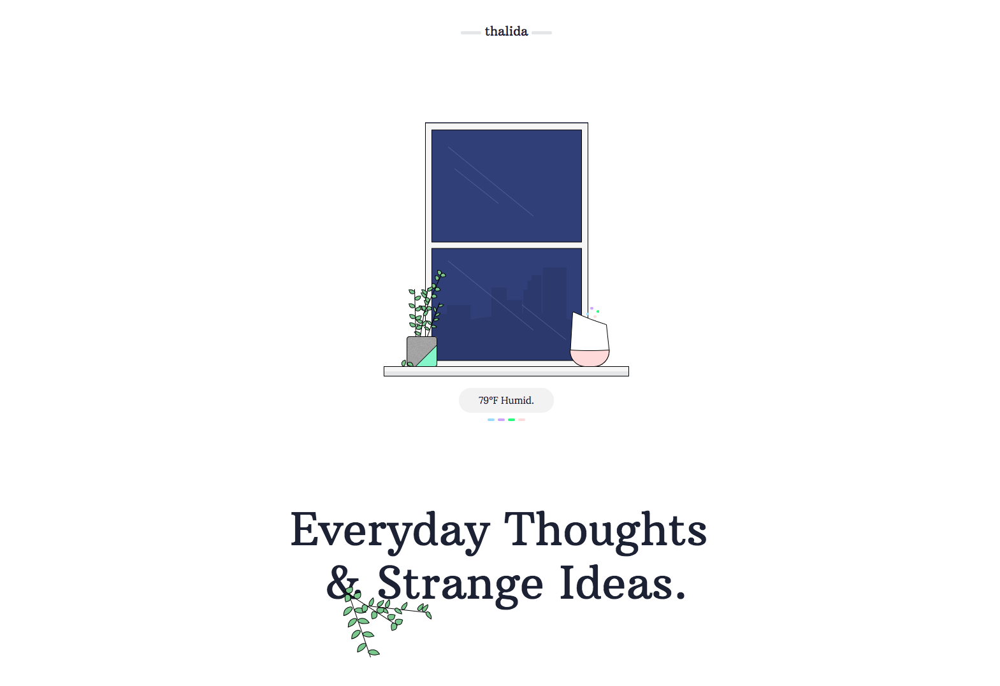
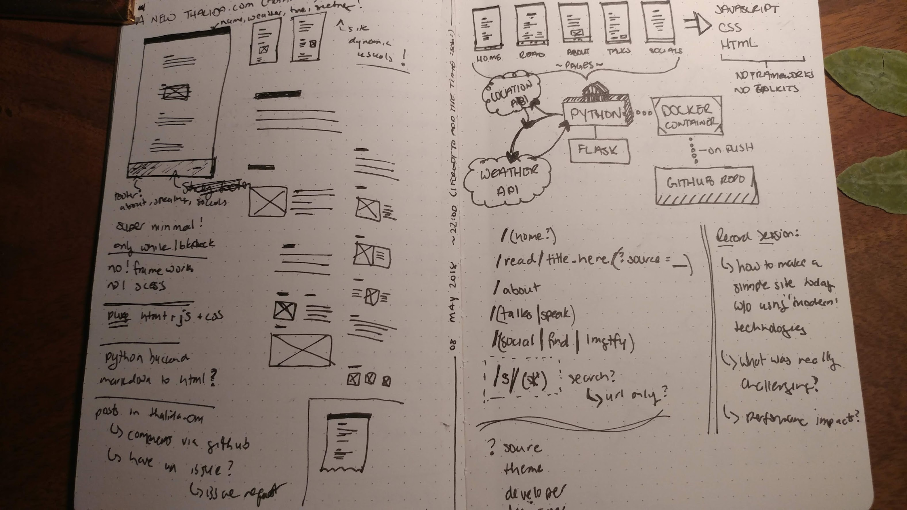
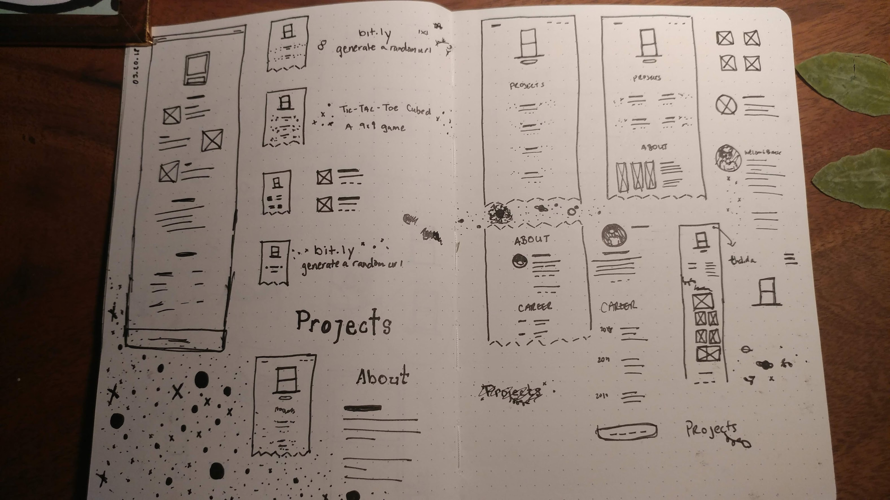
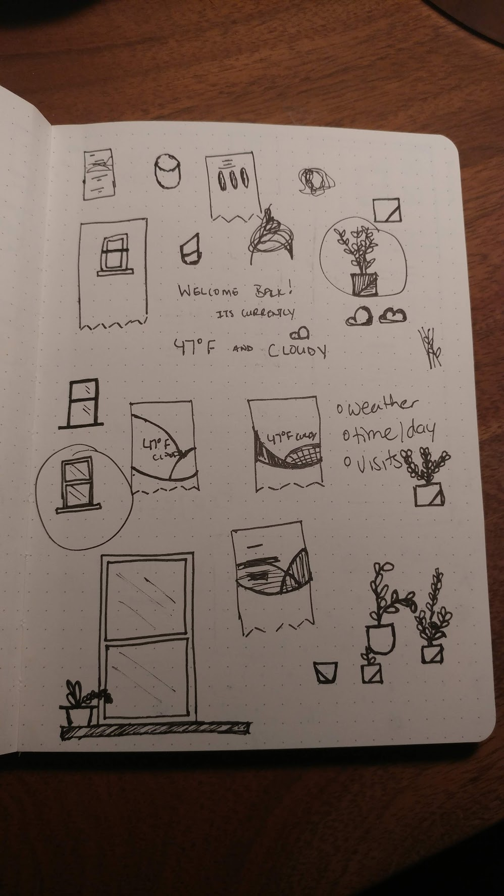
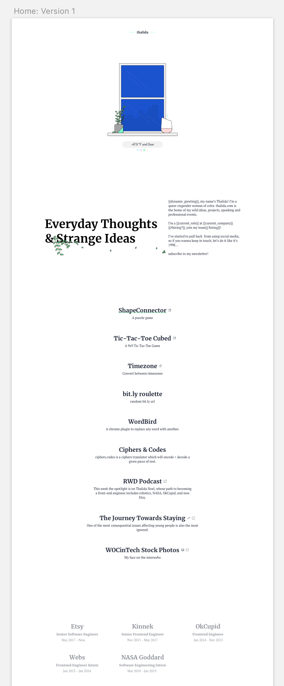
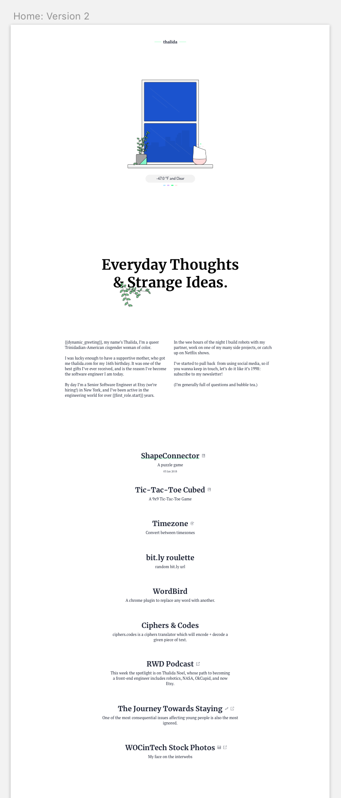
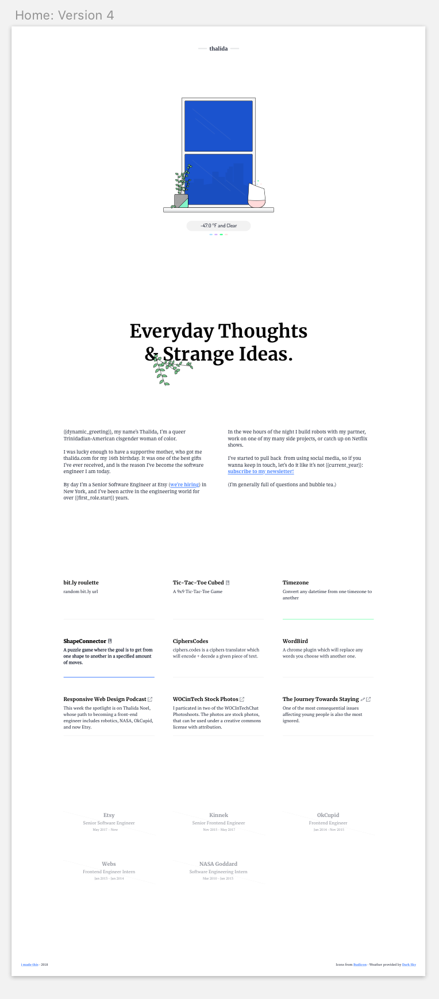
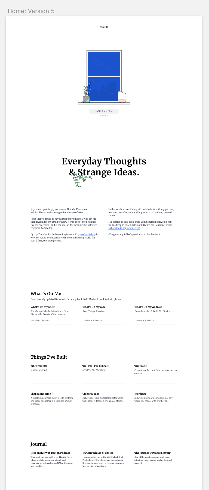
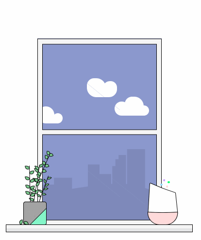
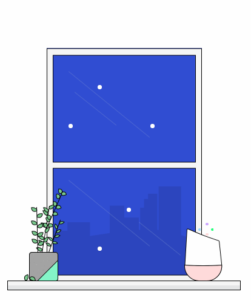

| **Year(s)** | **GitHub** | **Link** |
| ----------- | --------- | -------- |
| August 2018 - August 2022 | [Github →](https://github.com/thalida/thalida.com/tree/v-2018-2)  | [View Live →](https://2018-2.v.thalida.com) |

## Story

I wanted to create a super minimal site, using no frontend frameworks, in order to force myself to improve my backend skills with Python and the Flask Framework.

Also, I thought it’d be interesting to see what it’d be like to create a site now without the benefits of scss and other compilers. ­

## Inspiration & Sketching

### Sites I was inspired by (and what I liked about them)

[http://nicksigler.com/](http://nicksigler.com/)

- Bold Typography
- Serifs
- Columns

[http://www.turnislefthome.com/](http://www.turnislefthome.com/)

- Long List of Projects
- Case studies

[http://thingstoread.online/](http://thingstoread.online/)

- Grid

[http://www.brucira.com/](http://www.brucira.com/)

- Plants
- Illustrations

[http://www.zachroszczewski.com/](http://www.zachroszczewski.com/)

- Casestudies

[https://manuelmoreale.com/](https://manuelmoreale.com/)

- Minimal
- Serifs
- Long List of Posts

### Concept Sketches







## Design

### Iterations 1 and 2





Version 1 of my initial design alinged the most with my favorite concept sketches. After creating this version I realised more space was needed for my about text, and version 2 split the about section into two columns.

<aside>
👄 Shoutout to the missing version 3

</aside>

### Iterations 4 and 5





Version 4 changed my list of posts into a grid, once again to provide more space for a growing list of posts, and I also added link and post hover styles. (The missing version 3 was very similar to version 4 without link styles.) Version 5 introduced the concept of collections of posts, each with their own title and summary.

*Note: As always the transition from static mockup to live site resulted in changes to UI as I was able to fully interact with it and see it with live content.*

## How it Works

### Posts Collection

The most challening aspect of this site was creating the system to house my posts, the logic for the window is actually repurposed from other versions of my site.

The posts collection system is built upon [Python Markdown](https://python-markdown.github.io/), there’s an extension to add meta data, and this extension is a critical piece of how this version of thalida.com functions.

Each collection folder namespaced, for example the collection folder for this post is named: `collection.meta-timeline`. Inside the collection folder is a `_collection-meta.md` file with contents similar to this:

```css
Title: Meta Timeline
Summary: Explore the future, present, and past of thalida.com
Visual_Index: 1 // 0-indexed
Sort_Posts_By: -path
```

[View on github](https://github.com/thalida/thalida.com/tree/master/posts/collection/collection.meta-timeline)

The meta data above says the Meta Timeline Collection to be the second one shown, and I wanted the posts in this collection to be sorted by their path in reverse order.

There’s a lot more magic✨ happening, and I’m hoping to split PostsCollection out into a separate library with it’s own soon.

### Window





The weather uses your current locations time and weather data in order to render a view of “outside”. Even though the site is minimal elsewhere, I wanted to retain this live and dynamic to you aspect.

The color of the sky is based on the current time of day for your location, I use the sunrise and sunset time more accurately depict the time of day. The weather data is fetched from [DarkSky](https://darksky.net/poweredby/)‘s api, and I get your current location based on your IP address.

I created all of the illustrations used in the window with [Sketch](https://www.sketchapp.com/).

### Frontend Styles

The frontend for this version is a beautiful mess, I haven’t worked without scss on a complex project in a long time, and I can 100% say I don’t think I *ever* want to do that again.

Adding vendor prefixes manually, working without variables (css variables are coming though!), and not being able to use the scsss `&` all resulted in some very tedious styling.

In spite of all of that, I was able to create a site using modern css: flexbox, grid, and em/rems everywhere, all without using any of the trimings of modern-day frontend web development.

Snippet of the css used for styling the lines under the window label:

```scss
.**window__label__colors** .**google-home__color** {
  **display**: **block**;
  **position**: **absolute**;
  **top**: **0rem**;
  **left**: calc(**50%** - **0.3rem**);
  **margin**: **0**;
  **opacity**: **0**;
  -webkit-**animation-delay**: **500ms**;
          **animation-delay**: **500ms**;
  -webkit-**animation-duration**: **600ms**;
          **animation-duration**: **600ms**;
  -webkit-**animation-fill-mode**: **forwards**;
          **animation-fill-mode**: **forwards**;
  -webkit-**animation-iteration-count**: **1**;
          **animation-iteration-count**: **1**;
  -webkit-**animation-timing-function**: **linear**;
          **animation-timing-function**: **linear**;
}
  .**window__label__colors** .**google-home__color**.**google-home__color--blue** {
      -webkit-**animation-name**: **animation**-label-color--blue;
              **animation-name**: **animation**-label-color--blue;
  }
  .**window__label__colors** .**google-home__color**.**google-home__color--purple** {
      -webkit-**animation-name**: **animation**-label-color--purple;
              **animation-name**: **animation**-label-color--purple;
  }
  .**window__label__colors** .**google-home__color**.**google-home__color--green** {
      -webkit-**animation-name**: **animation**-label-color--green;
              **animation-name**: **animation**-label-color--green;
  }
  .**window__label__colors** .**google-home__color**.**google-home__color--pink** {
      -webkit-**animation-name**: **animation**-label-color--pink;
              **animation-name**: **animation**-label-color--pink;
  }
```
