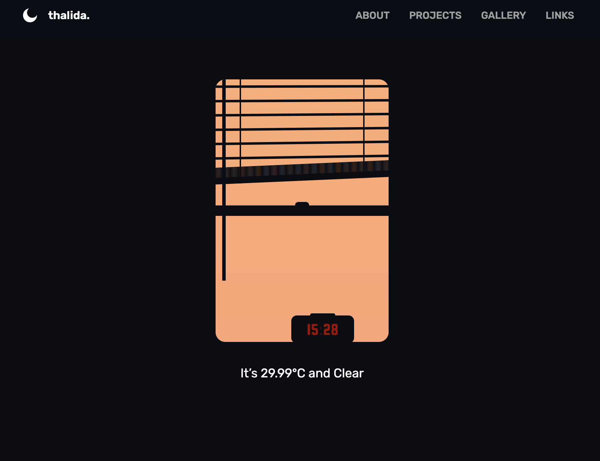
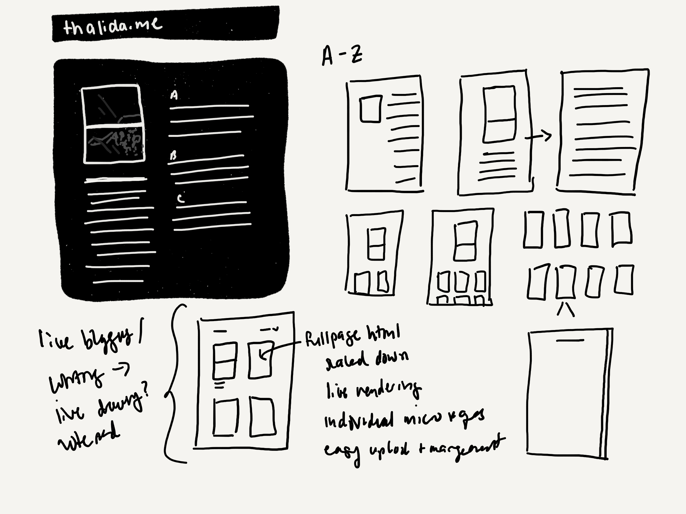
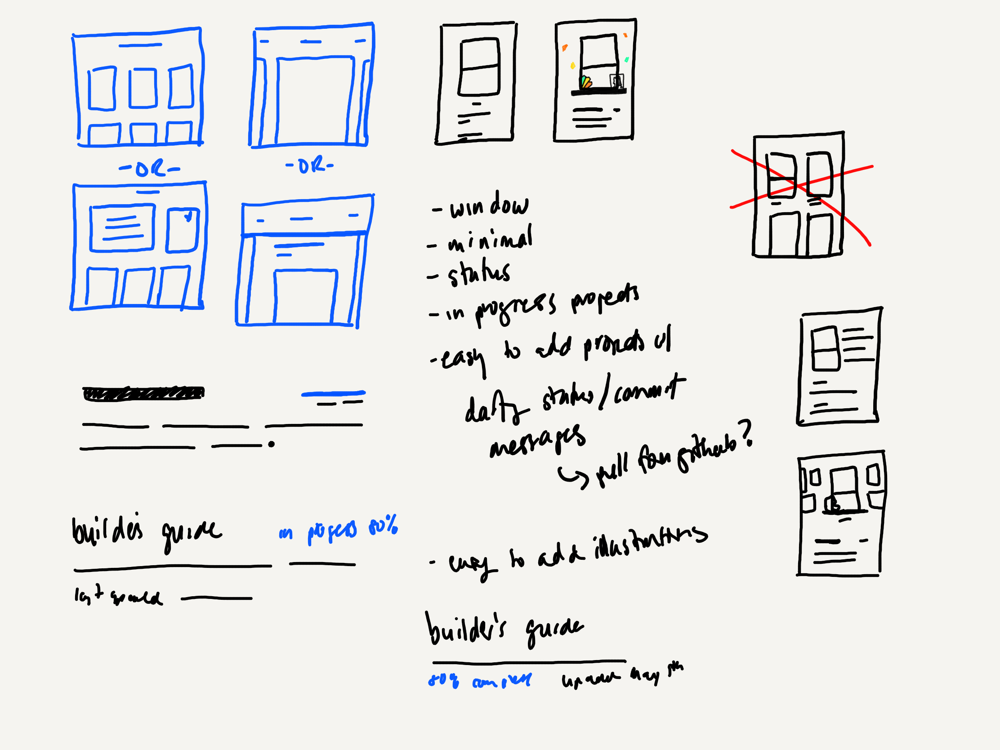
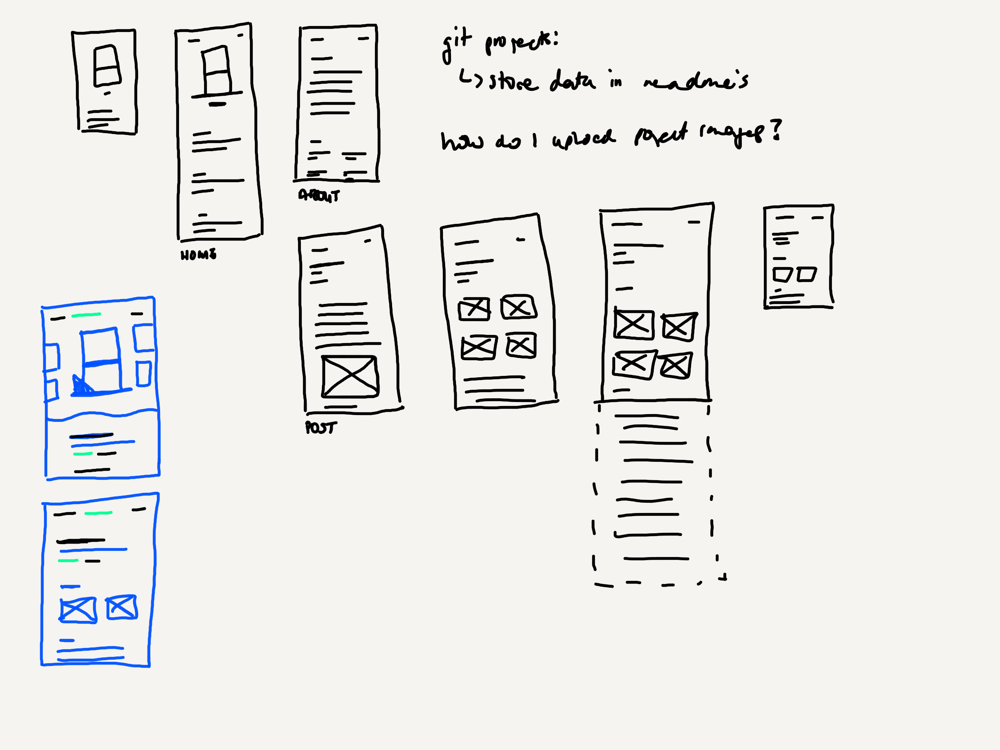
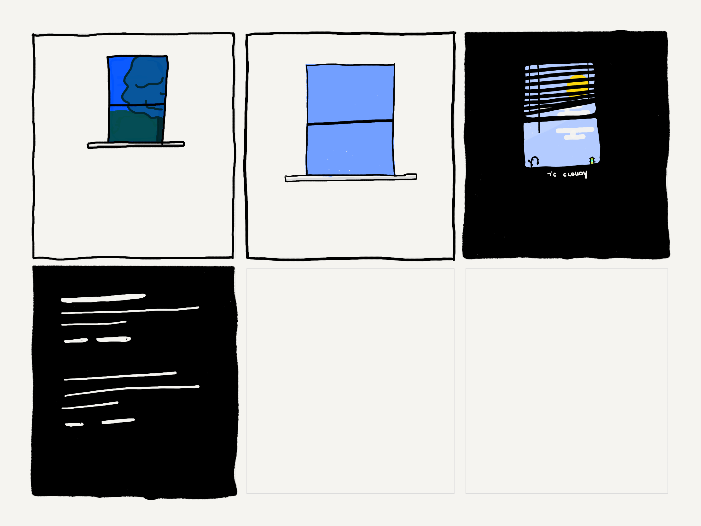
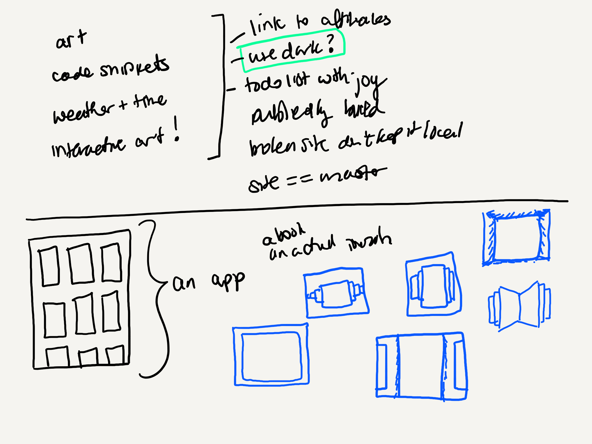
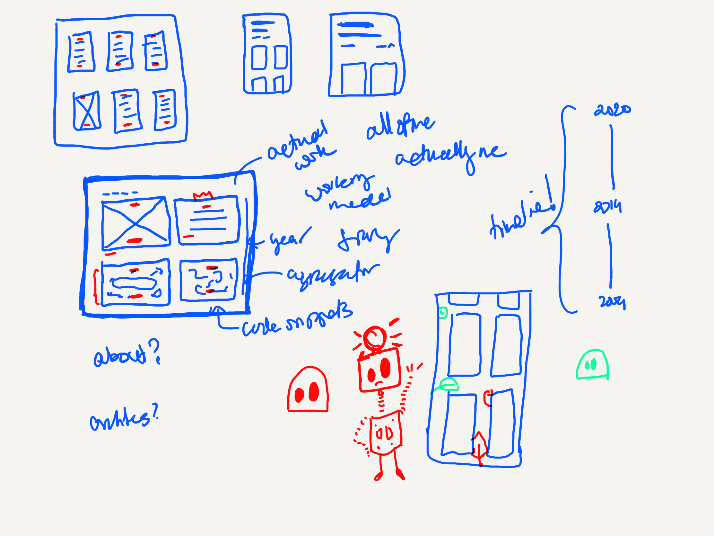
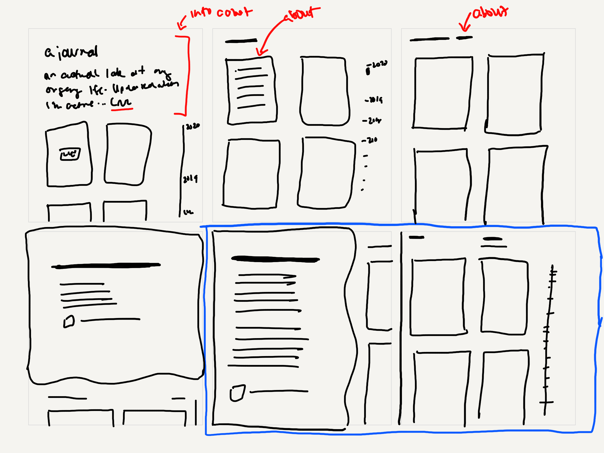

| **Year(s)** | **GitHub** | **Link** |
| ----------- | --------- | -------- |
| January 2022 - July 2025 | [Github →](https://github.com/thalida/thalida.com/tree/v-2022) | [Live →](https://thalida.com) |


## 💡Idea

For the next version of my domain, I wanted a site where I could easily add and edit content, a low-barrier way for me to provide updates on my work. After digging around, I came across [Super](https://super.so) and realized it was exactly what I needed.


## 👩🏾‍💻 Development


### Overview

The site is hosted on Super, pulling content from a notion site. The day/night-mode theme switcher, and the “live” window on the homepage use Svelte. This was my first time developing with Svelte, and I found it perfect for injecting a small javascript component onto the page. My custom theme styles and javascript are deployed and hosted on Vercel (Super supports custom code).


### Live Window

For this iteration of the Live Window, I switched to using the [Open Weather API](https://openweathermap.org/api), in order to get the users location I’m basing it off of their ip address, which I fetch using [IP Registry](https://ipregistry.co/).

```jsx
export async function fetchWeather($store) {
 // Partial version of this function, I've removed my caching logic
 await fetchLocation($store);

 const { lat, lng } = $store.location;
 const url = `https://api.openweathermap.org/data/2.5/weather?units=metric&lat=${lat}&lon=${lng}&appid=${OPEN_WEATHER_KEY}`;
 const { data } = await axios.get(url);
 $store.weather.current = {
   ...data.weather[0],
   temp: data.main.temp,
 };
 $store.weather.sunrise = data.sys.sunrise * 1000; // convert to milliseconds
 $store.weather.sunset = data.sys.sunset * 1000; // ^^
 $store.weather.lastFetched = Date.now();
 store.set($store);
 isDataFetched.set(true);
}
```


### `Deprecated` Theme Switcher (Day/Night Mode)

> [!NOTE]
> ⛔ **29 April 2023**
> An update of Super added support for a built-in theme switcher that I’ve started using instead.

For the first time, I’ve added a day/night mode switcher to my site. Finally in the future! It’s not finalized yet (I still don’t account for user preferences) but otherwise it’s fully functional.


You can checkout the code and fork this theme switcher on codpen! [https://codepen.io/thalida/pen/XWEVVaj](https://codepen.io/thalida/pen/XWEVVaj)

*This theme switcher is a fork of [https://codepen.io/sandeshsapkota/pen/xxVmMpe](https://codepen.io/sandeshsapkota/pen/xxVmMpe).*


## 🎨 Design


### Inspiration

[tsh by Thalida Noel](https://dribbble.com/thalida/collections/2416474-tsh)

[thalida 2020 v2 by Thalida Noel](https://dribbble.com/thalida/collections/2130994-thalida-2020-v2)

[thalida 2020 by Thalida Noel](https://dribbble.com/thalida/collections/1686189-thalida-2020)


### Paper Sketches














